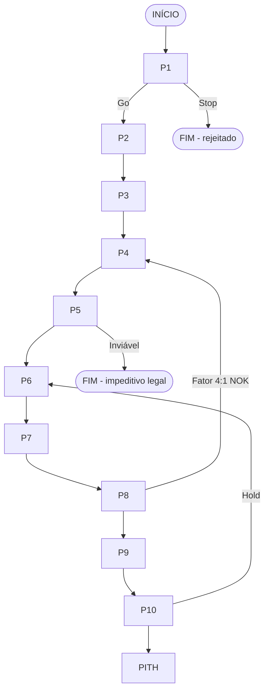

# KB CORE v5.0.1 — Sistema Operacional de Viabilidade (Consolidado)

> **Objetivo:** integrar o **método estratégico (10 Passos)** com a **execução operacional (Planilha TIV 103 abas + Skills)**, garantindo rastreabilidade, governança e decisão executiva defensável (**Go/Hold/No-Go**).

## Protocolo Fonte & Evidência — desta consolidação
- Baseado nos artefatos desta janela (checklists, orquestração, mapa de skills e documentos operacionais TIV vertical/horizontal).
- Sem introdução de premissas externas; wording harmonizado para v5.0.1.
- Rastreabilidade via INVENTORY_files.csv e PROVENANCE_registry.csv (quando anexados ao projeto).

## Sumário
1. [Visão Geral & Pipelines](#visao-geral-e-pipelines)  
2. [Pré-requisitos & Inputs](#pre-requisitos-e-inputs)  
3. [Passos 1–10 (com handshakes)](#passos-1–10-com-handshakes)  
4. [PITH — Relatório 45-45-10](#pith-relatorio-executivo-45-45-10)  
5. [Métricas, Gates e Decisão](#metricas-gates-e-decisao)  
6. [Integração Operacional (TIV 103 abas)](#integracao-operacional-tiv-103-abas)  
7. [Governança (GitHub, Releases, LFS)](#governanca-github-releases-lfs)  
8. [Rastreabilidade (Inventário & Proveniência)](#rastreabilidade-inventario-e-proveniencia)  
9. [Apêndices (Checklists, Modelos, Links internos)](#apendices-checklists-modelos-links-internos)

---

## Visão Geral & Pipelines
- **Três pipelines integrados**: Técnico (coleta→análise→validação→decisão), Analítico (fundamentos→produto→mercado→viabilidade) e Urbano-Ambiental (zoneamento→restrições→licenciamento).  
- **Handshakes formais** entre passos (ex.: P3→P4→P6→P7→P8→P9→P10→PITH), com gates de decisão (**Go/Hold/No-Go**).



---

## Pré-requisitos & Inputs
- **Inputs críticos por Passo**, fontes e tempos de coleta (IBGE, CAGED, Prefeitura, Cartório, Banco Central etc.).  
- **Checklists de obrigatórios/recomendados/opcionais** por P1…P10 e PITH.  
- **Criticidade**: P5 (jurídico/urbanístico), P6–P8 (mercado), P10 (funding, exposição máxima de caixa).

---

## Passos 1–10 (com handshakes)

### Passo 1 — Garimpo {#passo-1-garimpo}
**Entradas mínimas:** localização, área, preço, zoneamento preliminar.  
**Saídas:** *Go/Stop* para aprofundar.  
**Handshake:** habilita P2 e cria dossiê básico do terreno.

### Passo 2 — Dinâmica Econômica {#passo-2-dinamica-economica}
**Entradas:** IBGE, CAGED, renda, emprego, crescimento, vetores.  
**Saídas:** *score P2i-Lead* e contexto macro-local.  
**Handshake:** alimenta P3 (escala) e P4 (vocação preliminar).

### Passo 3 — Área de Influência {#passo-3-area-de-influencia}
**Entradas:** malha, tempos 15/30/45 min, população setorial.  
**Saídas:** polígono H3/tempo e população alvo.  
**Handshake:** alimenta P4 (produto), P6 (demanda) e P7 (oferta).

### Passo 4 — Vocação Imobiliária {#passo-4-vocacao-imobiliaria}
**Entradas:** score P2i-Lead, população P3, características do terreno, **zoneamento permitido**.  
**Saídas:** **produto preliminar** (H/V/misto), faixas de preço / m² alvo.  
**Handshake:** define insumos para P5 (enquadramento legal) e P6–P8.  
*Nota: ver inputs obrigatórios e recomendações em Checklists P4.*

### Passo 5 — Legal & Restrições {#passo-5-legal-e-restricoes}
**Entradas:** Plano Diretor, LUOS, Código de Obras, matrícula/ônus.  
**Saídas:** enquadramento urbanístico, restrições ambientais, condicionantes.  
**Handshake:** se **impeditivo**, *End2*; se **viável**, abre P6–P8 e parâmetros do P10 (regimes tributários, elegibilidade RET vs Presumido por tipologia).

### Passo 6 — Demanda {#passo-6-demanda}
**Entradas:** população por subárea (P3), **produto P4**, renda/financiamento atual, taxas (BCB).  
**Saídas:** **volume** e **preço viáveis** por tipologia.  
**Handshake:** pré-requisito para P7 (mapear oferta) e P8 (ritmo).

### Passo 7 — Oferta {#passo-7-oferta}
**Entradas:** polígono P3, produto P4, estimativas de P6.  
**Saídas:** inventário concorrente e **TBC** (terrenos com tramitação).  
**Handshake:** descreve contexto competitivo para P8.

### Passo 8 — Absorção (Fator 4:1) {#passo-8-absorção}
**Entradas:** demanda (P6), oferta (P7).  
**Saídas:** **ritmo defensável** de vendas por tipologia (**Fator 4:1**) e **curvas de comercialização** de referência.  
**Handshake crítico:** **P10 deve derivar a curva de vendas de P8** (sem “cronograma de desejo”).

### Passo 9 — Convalidação (Pesquisa Primária) {#passo-9-convalidação}
**Entradas:** questionário, amostra n, elasticidade.  
**Saídas:** validação de preço/ritmo, segmentação L1–L3.  
**Handshake:** ajusta P6–P8 ou confirma premissas antes do P10.

### Passo 10 — Viabilidade Financeira (FCD) {#passo-10-viabilidade-financeira-fcd}
**Entradas:** **curva de vendas gerada em P8**, custos (CUB/NBR 12721 + exclusões), **funding** (produção, associativo — vertical — ou modalidades de loteamento), tributos e **Exposição Máxima de Caixa**.  
**Saídas:** VPL/MTIR/ROI, **exposição máxima ≤ capacidade de funding**, *Go/Hold/No-Go*; cenários.  
**Handshake:** gera insumos para o **PITH**.  
*Regras operacionais por vertical/horizontal no Apêndice de modelos.*

---

## PITH — Relatório Executivo 45-45-10 {#pith-relatorio-executivo-45-45-10}
- **45%**: Fundamentação (P1–P5)  
- **45%**: Mercado→Curvas (P6–P9→P8)  
- **10%**: Decisão financeira (P10) + **Go/Hold/No-Go**  
**Anexos ao PITH:** planilhas, mapas (QGIS), extratos de fontes e trilhagem de evidências.  
*Estado: PITH estruturado e formalizado 45-45-10.*

---

## Métricas, Gates e Decisão
- **Gates:**  
  • **Legal (P5)** — bloqueio total se impeditivo.  
  • **Mercado (P8)** — Fator 4:1 como condição para “curva defensável”.  
  • **Financeiro (P10)** — **Exposição Máxima ≤ funding**.  
- **Metas de qualidade do sistema:** obsoletas=0; duplicadas=0; **conformidade ≥95%**; **handshakes=10**.

---

## Integração Operacional (TIV 103 abas)
- **Curvas de comercialização**: Curva 1 (compatível com crédito associativo e opção **pro-soluto**); Curvas 2/3 com regras simplificadas (pro-soluto sempre ativo).  
- **Regimes tributários (vertical):** exclusão mútua **RET vs Presumido**; evitar bitributação; ISS alocado em curso de obra.  
- **Loteamentos (horizontal):** sem crédito associativo; modalidades de funding típicas (**CRI, Prod Lote, Securitização, Exposição Total**).  
- **Regra-chave:** **P10 herda a curva de P8**; ajustes passam por P4/P6 quando Fator 4:1 falhar.

---

## Governança (GitHub, Releases, LFS)
- Repo com LFS para **.xlsx/.xlsm/.zip/.pdf**; branch `main` protegida; Release com **Bundles + HASHES**.  
- **CODEOWNERS** e workflows (`.github/workflows/checks.yml`) checando bundles e LFS.

---

## Rastreabilidade (Inventário & Proveniência)
- **INVENTORY_files.csv** — indexa artefatos (planilhas, anexos, bundles).  
- **PROVENANCE_registry.csv** — trilhagem de quem/onde/quando para cada métrica e arquivo.  
- Padrão de auditoria (YAML) **Fonte & Evidência**:
```yaml
auditoria:
  dado: "<nome e valor>"
  onde_encontrei:
    arquivo: "<nome>"
    recurso: "<aba/camada>"
    celula_ou_campo: "<ex.: FC!C12>"
  fonte_primaria: "<IBGE/CAGED/...>"
  base_temporal: "<YYYY-MM a YYYY-MM>"
  metodo_de_calculo: "<descrição curta>"
  evidencia: "<arquivo/link>"
  responsavel: "<nome>"
  data_coleta: "<YYYY-MM-DD>"
  limitacoes: "<se houver>"
  proximo_passo: "<validar/ajustar>"
```
---

## Apêndices (Checklists, Modelos, Links internos)
- **Checklists por Passo** com tempos, fontes e “como buscar”.  
- **Templates** (questionário P9, matriz de vocação P4, PITH 45-45-10).
