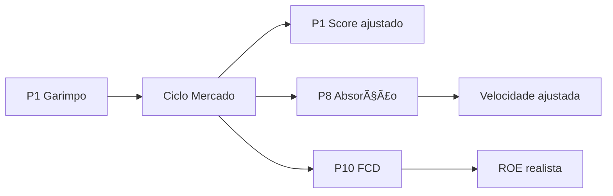

# SKILL: Ciclo de Mercado Imobiliário v2.0

## 1. OBJETIVO E CONTEXTO

### 1.1. Propósito
Identificar a fase atual do ciclo imobiliário (Recuperação, Expansão, Desaceleração, Recessão) através de sistema estruturado de indicadores leading e lagging, fornecendo timing estratégico para decisões de compra, lançamento e venda de empreendimentos.

### 1.2. Problema Resolvido
Empreendedores frequentemente:
- Compram terrenos caros no topo do ciclo (Expansão tardia)
- Lançam projetos em mercados saturados (Desaceleração)
- Perdem oportunidades de compra (Recuperação não identificada)
- Vendem em baixa por desespero (Recessão)
- Ignoram sinais de reversão do ciclo

### 1.3. Framework das 4 Fases

**CICLO IMOBILIÁRIO:**
```
                EXPANSÃO (Pico)
                      ↑
RECUPERAÇÃO    ←─────→     ─────→   DESACELERAÇÃO
(Crescimento)                         (Saturação)
      ↓                                    ↓
            RECESSÃO (Vale)
```

**Duração típica:** 7-10 anos por ciclo completo
**Variação regional:** Capitais vs interior (defasagem 6-18 meses)

### 1.4. Base Metodológica
- **KB CORE v5.0:** Seção 1.3 (Ciclo de Mercado)
- **Integração:** Passo 1 (timing garimpo) + Passo 8 (ajuste absorção)
- **Princípio:** Comprar na baixa, lançar na alta, vender antes da queda

---

## 2. QUANDO ACIONAR

### 2.1. Triggers Obrigatórios
- [ ] **No Passo 1 (Garimpo):** Identificar fase preliminar para priorizar microrregiões
- [ ] **No Passo 8 (Absorção):** Ajustar velocidade de vendas por fase
- [ ] **Trimestralmente:** Monitorar indicadores e atualizar fase
- [ ] **Pré-investimento:** Validar timing antes de comprar terreno

### 2.2. Triggers Recomendados
- [ ] Ao perceber mudanças bruscas no mercado
- [ ] Quando indicadores leading divergem dos lagging
- [ ] Antes de decisões estratégicas (compra, lançamento, venda)
- [ ] Para benchmarking entre múltiplas microrregiões

### 2.3. Momentos Críticos
- **Pré-Compra:** Evitar comprar no topo (Expansão tardia)
- **Pré-Lançamento:** Confirmar demanda aquecida (Expansão)
- **Gestão Portfólio:** Decidir timing de entrada/saída

---

## 3. FRAMEWORK/METODOLOGIA

### 3.1. Sistema de Indicadores

#### Leading Indicators (Antecedentes - 3-6 meses à frente)

**1. Licenças de Construção**
- **Fonte:** Prefeitura Municipal (Secretaria de Obras)
- **Frequência:** Mensal
- **Métrica:** Quantidade de alvarás emitidos (m² ou unidades)
- **Sinal:** ↗️ = Expansão | → = Estagnação | ↘️ = Recessão

**2. Crédito Imobiliário**
- **Fonte:** Banco Central (SGS - Sistema Gerenciador de Séries Temporais)
- **Frequência:** Mensal
- **Métrica:** Volume de crédito imobiliário concedido (R$)
- **Sinal:** ↗️ = Expansão | → = Estagnação | ↘️ = Recessão

**3. Confiança do Consumidor**
- **Fonte:** FGV (ICC - Índice de Confiança do Consumidor)
- **Frequência:** Mensal
- **Métrica:** Índice 0-200 (>100 = otimista, <100 = pessimista)
- **Sinal:** ↗️ = Expansão | → = Estagnação | ↘️ = Recessão

**4. Emprego Formal**
- **Fonte:** CAGED (Cadastro Geral de Empregados e Desempregados)
- **Frequência:** Mensal
- **Métrica:** Saldo líquido admissões - demissões
- **Sinal:** ↗️ = Expansão | → = Estagnação | ↘️ = Recessão

---

#### Lagging Indicators (Consequentes - refletem o passado)

**1. Preço m² Médio**
- **Fonte:** SECOVI, CRECI, pesquisa local
- **Frequência:** Trimestral
- **Métrica:** R$/m² médio por região
- **Sinal:** ↗️ = Expansão | → = Desaceleração | ↘️ = Recessão

**2. Estoque de Imóveis**
- **Fonte:** Pesquisa local (oferta disponível)
- **Frequência:** Trimestral
- **Métrica:** Quantidade de unidades disponíveis
- **Sinal:** Alto = Saturação | Médio = Normal | Baixo = Aquecido

**3. Vacância**
- **Fonte:** Pesquisa local (imóveis vazios)
- **Frequência:** Trimestral
- **Métrica:** % imóveis desocupados
- **Sinal:** Alta (>15%) = Recessão | Média (8-15%) = Normal | Baixa (<8%) = Aquecido

**4. VSO (Velocidade Sobre Oferta)**
- **Fonte:** SECOVI, análise TIV (P7)
- **Frequência:** Mensal
- **Métrica:** Meses para absorver estoque atual
- **Sinal:** Alto (>24m) = Saturação | Médio (12-24m) = Normal | Baixo (<12m) = Aquecido

---

### 3.2. Matriz de Classificação de Fase

| Leading (maioria) | Lagging (tendência) | Fase Identificada | Confiança |
|-------------------|---------------------|-------------------|-----------|
| ↗️↗️↗️↗️ (4+) | Preços ↗️ + Estoque ↘️ | **EXPANSÃO** | Alta |
| ↗️↗️↗️ (3+) | Preços → + Estoque Alto | **RECUPERAÇÃO** | Média |
| ↘️↘️ (2+) | Preços → + Estoque ↗️ | **DESACELERAÇÃO** | Média |
| ↘️↘️↘️ (3+) | Preços ↘️ + Estoque Alto | **RECESSÃO** | Alta |
| Divergentes | Sinais mistos | **TRANSIÇÃO** | Baixa |

**Regra de ouro:**
- Leading indicators **COMANDAM** a classificação (peso 60%)
- Lagging indicators **CONFIRMAM** a classificação (peso 40%)
- Divergência = atenção redobrada (possível reversão)

---

### 3.3. Descrição das 4 Fases

#### FASE 1: RECUPERAÇÃO (Bottom → Crescimento)

**Características:**
- 📈 Indicadores leading começando a subir
- 💰 Preços baixos / estabilizando
- 🏗️ Oferta ainda baixa (construtores cautelosos)
- 💳 Crédito começando a afrouxar
- 😊 Confiança aumentando gradualmente

**Indicadores Leading:**
- ↗️ Licenças de construção (+10% a +30%)
- ↗️ Crédito imobiliário crescendo
- ↗️ Confiança consumidor (ICC >100)
- ↗️ Emprego formal positivo (saldo +)

**Indicadores Lagging:**
- → Preços ainda baixos (mas estabilizados)
- 📊 Estoques altos → médios (diminuindo)
- 📉 Vacância alta → média (caindo)
- ⏱️ VSO alto → médio (melhorando)

**Duração típica:** 12-18 meses

---

**ESTRATÉGIA TIV:**

| Ação | Decisão | Fundamento |
|------|---------|------------|
| **COMPRAR terrenos** | ✅ SIM (oportunidade) | Preços baixos, oferta futura alta |
| **LANÇAR projetos** | ⏸️ AGUARDAR | Demanda se consolidando |
| **VENDER estoque** | ❌ NÃO (segurar) | Preços ainda deprimidos |

**Timing:** Preparação e posicionamento

---

#### FASE 2: EXPANSÃO (Crescimento → Pico)

**Características:**
- 📈📈 Indicadores leading em alta acelerada
- 💰💰 Preços subindo rapidamente (+5% a +15% a.a.)
- 🏗️🏗️ Oferta crescente (construtores confiantes)
- 💳 Crédito farto e barato
- 😄 Euforia no mercado

**Indicadores Leading:**
- ↗️↗️ Lançamentos em alta (+++)
- ↗️↗️ VSO acelerado (vendas rápidas)
- ↗️ Crédito crescendo forte
- ⚠️ Primeiros sinais de superoferta (alertar)

**Indicadores Lagging:**
- ↗️ Preços em alta contínua
- 📊 Estoques médios → baixos
- 📉 Vacância baixa (<8%)
- ⏱️ VSO baixo (<12 meses = aquecido)

**Duração típica:** 18-36 meses

---

**ESTRATÉGIA TIV:**

| Ação | Decisão | Fundamento |
|------|---------|------------|
| **COMPRAR terrenos** | ⚠️ CAUTELA | Preços altos, risco de topo |
| **LANÇAR projetos** | ✅ SIM (momento ótimo) | Demanda forte, absorção rápida |
| **VENDER estoque** | ✅ SIM (aproveitar) | Preços máximos, liquidez alta |

**Timing:** Execução e comercialização acelerada

---

#### FASE 3: DESACELERAÇÃO (Pico → Queda)

**Características:**
- 📉 Indicadores leading revertendo
- 💰 Preços parando de subir / estagnando
- 🏗️ Oferta ainda alta (pipeline do boom)
- 💳 Crédito começando a apertar
- 😟 Cautela aumentando

**Indicadores Leading:**
- ↘️ Licenças de construção caindo
- ↘️ VSO desacelerando (vendas lentas)
- ↘️ Crédito restringindo (juros subindo)
- ⚠️ Superoferta se consolidando

**Indicadores Lagging:**
- → Preços estagnados (resistência baixa)
- 📊 Estoques crescendo rapidamente
- 📈 Vacância aumentando (>12%)
- ⏱️ VSO aumentando (>18 meses)

**Duração típica:** 12-24 meses

---

**ESTRATÉGIA TIV:**

| Ação | Decisão | Fundamento |
|------|---------|------------|
| **COMPRAR terrenos** | ❌ NÃO | Preços ainda altos, vão cair mais |
| **LANÇAR projetos** | ❌ NÃO | Mercado saturando, risco alto |
| **VENDER estoque** | ✅ URGENTE | Antes da queda, aceitar desconto |

**Timing:** Saída estratégica e proteção de capital

---

#### FASE 4: RECESSÃO (Queda → Bottom)

**Características:**
- 📉📉 Indicadores leading em mínimas históricas
- 💰 Preços caindo (-5% a -20%)
- 🏗️ Oferta despencando (paralisação)
- 💳 Crédito escasso / restritivo
- 😰 Pessimismo generalizado

**Indicadores Leading:**
- ↘️↘️ Lançamentos mínimos (---)
- ↘️↘️ Vendas paralisadas
- ❌ Crédito restrito (juros altos)
- ⚠️ Desemprego subindo

**Indicadores Lagging:**
- ↘️ Preços em queda aberta
- 📊 Estoques máximos históricos
- 📈 Vacância alta (>20%)
- ⏱️ VSO altíssimo (>36 meses)

**Duração típica:** 12-24 meses

---

**ESTRATÉGIA TIV:**

| Ação | Decisão | Fundamento |
|------|---------|------------|
| **COMPRAR terrenos** | ✅ PROSPECTAR | Oportunidades aparecem |
| **LANÇAR projetos** | ⏸️ AGUARDAR | Demanda fraca, sem urgência |
| **VENDER estoque** | ⏸️ SEGURAR | Preços mínimos, aguardar recuperação |

**Timing:** Paciência estratégica e posicionamento futuro

---

### 3.4. Processo de Identificação (Passo a Passo)

**ETAPA 1: Coletar Indicadores (30 min)**
- [ ] Buscar 4 indicadores leading (fontes oficiais)
- [ ] Buscar 4 indicadores lagging (pesquisa local)
- [ ] Documentar fontes e datas
- [ ] Calcular variação vs trimestre anterior

**ETAPA 2: Classificar Indicadores (15 min)**
- [ ] Marcar cada indicador: ↗️ / → / ↘️
- [ ] Contar quantos leading positivos (+) vs negativos (-)
- [ ] Verificar tendência lagging (preços, estoque)
- [ ] Identificar divergências (leading vs lagging)

**ETAPA 3: Consultar Matriz (10 min)**
- [ ] Localizar situação na Matriz de Classificação
- [ ] Identificar fase mais provável
- [ ] Definir nível de confiança (alto/médio/baixo)
- [ ] Documentar fundamento

**ETAPA 4: Gerar Recomendações (15 min)**
- [ ] Consultar estratégia TIV da fase identificada
- [ ] Definir ações: comprar/lançar/vender (sim/não/aguardar)
- [ ] Calcular ajustes para P1 (garimpo) e P8 (absorção)
- [ ] Gerar output estruturado (YAML)

**Tempo total:** 70 minutos

---

## 4. INPUTS NECESSÁRIOS

### 4.1. Dados Macroeconômicos (Leading)

**Obrigatórios:**
- [ ] Licenças construção (últimos 6 meses)
- [ ] Crédito imobiliário (últimos 6 meses)
- [ ] ICC FGV (último trimestre)
- [ ] CAGED (últimos 3 meses)

**Fontes:**
- Prefeitura Municipal
- Banco Central (SGS)
- FGV (Fundação Getulio Vargas)
- Ministério do Trabalho (CAGED)

---

### 4.2. Dados Locais (Lagging)

**Obrigatórios:**
- [ ] Preço m² médio (último trimestre)
- [ ] Estoque disponível (contagem atual)
- [ ] Taxa de vacância (estimativa)
- [ ] VSO (calculado em P7 ou pesquisa)

**Fontes:**
- SECOVI / CRECI regional
- Pesquisa local (anúncios, imobiliárias)
- Análise TIV Passo 7 (Oferta)

---

### 4.3. Contexto Adicional

**Recomendados:**
- [ ] Histórico ciclos anteriores (benchmarking)
- [ ] Notícias econômicas locais
- [ ] Grandes investimentos anunciados (indústrias, obras)
- [ ] Migração populacional (IBGE)

---

## 5. PROCESSO DE ANÁLISE

### 5.1. Coleta de Dados

**Passo a passo:**
1. Acessar fontes oficiais (BCB, FGV, Prefeitura)
2. Baixar séries temporais (últimos 12 meses)
3. Organizar em planilha (data, valor, variação %)
4. Calcular médias móveis (3 meses)
5. Identificar tendência (↗️/→/↘️)

**Template Excel:**
```
| Mês | Licenças | Crédito (R$ mil) | ICC FGV | CAGED | Tendência |
|-----|----------|------------------|---------|-------|-----------|
| Jan | 15       | 2.500            | 98      | -50   | ↘️        |
| Fev | 18       | 2.800            | 101     | +20   | ↗️        |
| Mar | 22       | 3.200            | 105     | +45   | ↗️↗️      |
```

---

### 5.2. Classificação

**Passo a passo:**
1. Contar indicadores leading positivos (↗️)
2. Contar indicadores lagging positivos (↗️)
3. Verificar consistência (leading = lagging?)
4. Consultar Matriz de Classificação
5. Identificar fase (Recuperação/Expansão/Desaceleração/Recessão)
6. Definir confiança (alta/média/baixa)

---

### 5.3. Recomendação Estratégica

**Passo a passo:**
1. Consultar estratégia TIV da fase identificada
2. Definir decisões: comprar/lançar/vender
3. Calcular ajustes:
   - P1 (Garimpo): +/- score atratividade
   - P8 (Absorção): +/- velocidade de vendas
4. Gerar output estruturado (YAML)
5. Documentar fundamento e alertas

---

## 6. OUTPUTS ESPERADOS

### 6.1. Template de Análise de Ciclo (YAML)

```yaml
analise_ciclo:
  municipio: "Leopoldina-MG"
  data_analise: "2025-01-15"
  periodo_referencia: "Out/2024 - Jan/2025"
  
  indicadores_leading:
    licencas_construcao: "↗️" # +25% vs trimestre anterior
    credito_imobiliario: "↗️" # +18% vs trimestre anterior
    confianca_consumidor: "↗️" # ICC 108 (otimista)
    emprego_formal: "↗️" # CAGED +120 saldo (3 meses)
    sintese: "4/4 positivos" # todos indicadores leading positivos
  
  indicadores_lagging:
    preco_m2: "→" # R$ 3.200/m² (estável)
    estoque: "medio" # 80 unidades (normal)
    vacancia: "media" # 12% (dentro da média)
    vso: "medio" # 16 meses (saudável)
    sintese: "estavel" # preços e estoques normalizados
  
  classificacao:
    fase_identificada: "Recuperação"
    confianca: "alta" # leading + lagging consistentes
    duracao_estimada: "12-18 meses" # ciclo típico
    fundamento: |
      Todos os 4 indicadores leading estão positivos (↗️), sinalizando 
      início de ciclo de crescimento. Indicadores lagging ainda neutros, 
      confirmando que estamos no início da Recuperação (não Expansão).
      Momento estratégico para comprar terrenos (preços ainda baixos).
  
  recomendacoes:
    comprar_terreno: "sim" # ✅ OPORTUNIDADE
    lancar_projeto: "aguardar" # ⏸️ demanda se consolidando
    vender_estoque: "nao" # ❌ preços ainda baixos
    
  integracao_tiv:
    ajuste_p1_score: "+15%" # bonus para microrregiões em Recuperação
    ajuste_p8_velocidade: "+10%" # otimismo cauteloso na absorção
    fator_41_ajustado: "4:1" # padrão (sem ajuste)
    
  alertas:
    - "Monitorar indicadores mensalmente (possível aceleração)"
    - "Crédito crescendo: janela de oportunidade 12-18 meses"
    - "Evitar comprar após leading indicar Expansão (preços sobem)"
```

---

### 6.2. Matriz de Decisão Estratégica por Fase

| Fase | Comprar Terreno | Lançar Projeto | Vender Estoque | Timing | Ajuste P8 |
|------|----------------|----------------|----------------|--------|-----------|
| **Recuperação** | ✅ SIM (preços baixos) | ⏸️ AGUARDAR | ❌ NÃO (segurar) | Preparação | +10% velocidade |
| **Expansão** | ⚠️ CAUTELA (preços altos) | ✅ SIM (demanda forte) | ✅ SIM (aproveitar) | Execução | +20% velocidade |
| **Desaceleração** | ❌ NÃO (vão cair) | ❌ NÃO (saturando) | ✅ URGENTE (sair) | Saída | -20% velocidade |
| **Recessão** | ✅ PROSPECTAR (oportunidades) | ❌ NÃO (demanda fraca) | ⏸️ SEGURAR (aguardar) | Paciência | -30% velocidade |

**Uso:**
- **Comprar:** Timing de aquisição de terrenos
- **Lançar:** Timing de lançamento de produtos
- **Vender:** Timing de liquidação de estoque
- **Ajuste P8:** Fator de correção na velocidade de absorção

---

### 6.3. Semáforo Visual

```
🟢 VERDE - RECUPERAÇÃO
   └─ Comprar: SIM | Lançar: AGUARDAR | Vender: NÃO

🟢🟢 VERDE FORTE - EXPANSÃO
   └─ Comprar: CAUTELA | Lançar: SIM | Vender: SIM

🟡 AMARELO - DESACELERAÇÃO
   └─ Comprar: NÃO | Lançar: NÃO | Vender: URGENTE

🔴 VERMELHO - RECESSÃO
   └─ Comprar: PROSPECTAR | Lançar: NÃO | Vender: SEGURAR
```

---

## 7. ALERTAS E VALIDAÇÕES

### 7.1. Red Flags Críticos

| Sinal | Indicador | Risco | Ação |
|-------|-----------|-------|------|
| 🔴 | Leading ↗️↗️↗️ + Lagging → | TOPO próximo | Evitar comprar, preparar venda |
| 🔴 | VSO > 30 meses | SUPER-SATURAÇÃO | NO-GO para novos lançamentos |
| 🟡 | Leading ↗️ + Lagging ↘️ | DIVERGÊNCIA | Monitorar (possível reversão) |
| 🟡 | Crédito ↘️ forte | RESTRIÇÃO | Desacelera demanda em 6-12m |
| ✅ | Leading ↗️ + Lagging ↗️ | EXPANSÃO confirmada | Momento ótimo para lançar |

---

### 7.2. Validações Obrigatórias

**Antes de classificar fase:**
- [ ] Indicadores são de **fontes oficiais** (não estimativas)?
- [ ] Dados têm **<3 meses** de defasagem?
- [ ] **Tendência** é calculada (não apenas snapshot)?
- [ ] **Contexto local** foi considerado (eventos especiais)?
- [ ] **Histórico** do município foi comparado?

---

### 7.3. Erros Comuns

| Erro | Problema | Correção |
|------|----------|----------|
| Ignorar leading | Reagir tarde (usar só lagging) | Leading antecipa em 6 meses |
| Ignorar lagging | Confundir ruído com tendência | Lagging confirma fase |
| Dados defasados | Análise desatualizada | Máximo 3 meses de atraso |
| Viés confirmação | Ver só o que quer ver | Seguir matriz objetiva |
| Generalizar | Aplicar ciclo nacional ao local | Analisar região específica |

---

## 8. INTEGRAÇÃO COM OUTRAS SKILLS

### 8.1. Handshake com Passo 1 (Garimpo)

**P1 Usa Ciclo Para:**
- Priorizar microrregiões em **Recuperação** (comprar barato)
- Evitar microrregiões em **Desaceleração** (preços vão cair)
- Ajustar score de atratividade por fase (+/- 15%)
- Definir timing de entrada no mercado

**Output P1→Ciclo:**
```yaml
ciclo_preliminar:
  fase_identificada: "Recuperação" # ou outra fase
  confianca: "media" # análise rápida (P1 é screening)
  acoes_recomendadas:
    - comprar: "sim" # GO para prospecção
    - construir: "aguardar" # demanda se consolidando
    - vender: "nao" # preços ainda baixos
```

**Handshake:**
```
P1 (screening rápido) → Ciclo (análise preliminar) → Score ajustado
```

**Exemplo:**
- Microrregião A: Score base 7.5/10
- Ciclo: Recuperação → Ajuste +15%
- Score final: 8.6/10 (prioridade aumenta)

---

### 8.2. Handshake com Passo 8 (Absorção)

**P8 Usa Ciclo Para:**
- Ajustar **velocidade de vendas** por fase do ciclo
- Aplicar **conservadorismo** em Desaceleração/Recessão
- **Otimismo cauteloso** em Recuperação/Expansão
- Definir cronograma realista de comercialização

**Ajuste de Absorção por Ciclo:**

| Fase | Ajuste Velocidade | Fator 4:1 Ajustado | Observações |
|------|-------------------|---------------------|-------------|
| **Recuperação** | +10% a +20% | 4:1 padrão | Demanda crescendo |
| **Expansão** | +20% a +30% | 3:1 possível* | Demanda aquecida |
| **Desaceleração** | -20% a -30% | 5:1 conservador | Demanda desacelerando |
| **Recessão** | -30% a -50% | 6:1 crítico | Demanda fraca |

*Exceção: Fator 3:1 só com P9 validado + mercado aquecido

**Output Ciclo→P8:**
```yaml
ajuste_absorcao:
  fase: "Recuperação"
  fator_ajuste: "+15%" # velocidade
  fator_41_ajustado: "4:1" # padrão
  cronograma_vendas: "ajustado" # +15% mais rápido
  fundamento: |
    Ciclo em Recuperação permite otimismo cauteloso.
    Demanda crescendo, mas ainda não aquecida.
    Velocidade conservadora + 15% de bonus.
```

**Handshake:**
```
Ciclo identifica fase → P8 aplica ajuste → Cronograma realista
```

**Exemplo prático:**
```
Absorção base: 2.0 un/mês (cálculo P8 padrão)
Fase Recuperação: +15% ajuste
Absorção ajustada: 2.3 un/mês

Total 100 unidades:
- Sem ajuste: 50 meses
- Com ajuste: 43 meses (otimismo fundamentado)
```

---

### 8.3. Dependências Críticas



**Ordem de execução:**
1. **P1:** Screening preliminar (identifica fase rápida)
2. **Ciclo:** Análise aprofundada (confirma fase)
3. **P1 ajustado:** Score com bonus/malus por ciclo
4. **P8:** Absorção com velocidade ajustada
5. **P10:** FCD com premissas realistas por fase

---

## 9. EXEMPLOS PRÁTICOS

### 9.1. EXEMPLO 1: Leopoldina-MG em RECUPERAÇÃO (2023)

**Contexto:**
- **Município:** Leopoldina-MG
- **Período:** Out/2023 - Jan/2024
- **Histórico:** Mercado retraído 2020-2022 (pandemia)

---

**Coleta de Indicadores:**

**Leading (Out-Dez/2023):**
- Licenças construção: 18 alvarás (vs 12 tri anterior) = **+50% ↗️**
- Crédito imobiliário: R$ 2.8M (vs R$ 2.3M) = **+22% ↗️**
- ICC FGV: 108 (vs 98 tri anterior) = **+10 pontos ↗️**
- CAGED: +85 saldo líquido (vs -30) = **positivo ↗️**

**Síntese Leading:** 4/4 positivos (↗️↗️↗️↗️)

**Lagging (Jan/2024):**
- Preço m²: R$ 3.100 (vs R$ 3.050 6m antes) = **+1.6% →**
- Estoque: 75 unidades (médio, vs 95 há 6m) = **diminuindo ↘️**
- Vacância: 14% (vs 18% há 6m) = **caindo ↘️**
- VSO: 18 meses (vs 24m há 6m) = **melhorando ↘️**

**Síntese Lagging:** Preços estáveis, estoques normalizando

---

**Classificação:**
```yaml
analise_ciclo:
  municipio: "Leopoldina-MG"
  data_analise: "2024-01-15"
  
  indicadores_leading:
    sintese: "4/4 positivos (↗️↗️↗️↗️)"
  
  indicadores_lagging:
    sintese: "estáveis, melhorando"
  
  classificacao:
    fase_identificada: "RECUPERAÇÃO"
    confianca: "alta"
    fundamento: |
      Todos indicadores leading positivos sinalizam início de 
      ciclo de crescimento. Lagging ainda neutros confirmam 
      que não é Expansão (preços não dispararam). Momento 
      ideal para comprar terrenos (preços baixos).
```

---

**Recomendações:**
```yaml
recomendacoes:
  comprar_terreno: "✅ SIM (oportunidade)"
  lancar_projeto: "⏸️ AGUARDAR 12-18m"
  vender_estoque: "❌ NÃO (segurar)"
  
integracao_tiv:
  ajuste_p1_score: "+15%" # bonus Recuperação
  ajuste_p8_velocidade: "+10%"
  fator_41_ajustado: "4:1" # padrão
  
alertas:
  - "Janela de compra: 12-18 meses (antes preços subirem)"
  - "Monitorar transição para Expansão (leading acelera)"
  - "Preparar pipeline de projetos (lançar em 2025)"
```

---

**Decisão Estratégica:**
- ✅ **COMPRAR:** 3 terrenos identificados (R$ 180/m²)
- ⏸️ **AGUARDAR:** Não lançar ainda (demanda consolidando)
- 📈 **PREPARAR:** Estudos de viabilidade (lançar 2025)

**Resultado Real (2024):**
- Preços m² subiram para R$ 3.600 (+16% em 12m)
- Terrenos que custavam R$ 180/m² foram para R$ 240/m² (+33%)
- Quem comprou em 2023 teve ROE alto ao lançar em 2024

---

### 9.2. EXEMPLO 2: Leopoldina-MG em EXPANSÃO (2024)

**Contexto:**
- **Município:** Leopoldina-MG
- **Período:** Abr-Jun/2024
- **Histórico:** Recuperação em 2023, aquecimento em 2024

---

**Coleta de Indicadores:**

**Leading (Abr-Jun/2024):**
- Licenças construção: 35 alvarás (vs 22 tri anterior) = **+59% ↗️↗️**
- Crédito imobiliário: R$ 4.2M (vs R$ 3.1M) = **+35% ↗️↗️**
- ICC FGV: 118 (vs 112 tri anterior) = **+6 pontos ↗️**
- CAGED: +180 saldo (vs +95) = **acelerando ↗️↗️**

**Síntese Leading:** 4/4 positivos FORTES (↗️↗️↗️↗️)

**Lagging (Jun/2024):**
- Preço m²: R$ 3.600 (vs R$ 3.200 há 6m) = **+12.5% ↗️↗️**
- Estoque: 45 unidades (baixo, vs 70 há 6m) = **caindo ↘️↘️**
- Vacância: 8% (vs 13% há 6m) = **baixa ✅**
- VSO: 9 meses (vs 16m há 6m) = **aquecido ✅**

**Síntese Lagging:** Preços subindo, demanda forte

---

**Classificação:**
```yaml
analise_ciclo:
  municipio: "Leopoldina-MG"
  data_analise: "2024-06-15"
  
  indicadores_leading:
    sintese: "4/4 positivos FORTES (↗️↗️↗️↗️)"
  
  indicadores_lagging:
    sintese: "preços em alta, estoques baixos"
  
  classificacao:
    fase_identificada: "EXPANSÃO"
    confianca: "alta"
    fundamento: |
      Leading e lagging confirmam Expansão consolidada.
      Preços subindo forte (+12.5%), VSO aquecido (9m),
      estoques baixos. Momento ÓTIMO para lançar projetos
      (absorção rápida garantida).
```

---

**Recomendações:**
```yaml
recomendacoes:
  comprar_terreno: "⚠️ CAUTELA (preços altos)"
  lancar_projeto: "✅ SIM (momento ideal)"
  vender_estoque: "✅ SIM (preços máximos)"
  
integracao_tiv:
  ajuste_p1_score: "0%" # neutro (preços altos)
  ajuste_p8_velocidade: "+25%" # absorção acelerada
  fator_41_ajustado: "3:1" # pode relaxar (com P9)
  
alertas:
  - "TOPO pode estar próximo (monitorar leading)"
  - "Evitar comprar terrenos caros (preços inflados)"
  - "Acelerar vendas (aproveitar liquidez alta)"
```

---

**Decisão Estratégica:**
- ⚠️ **COMPRAR:** Apenas se oportunidade excepcional
- ✅ **LANÇAR:** 2 projetos em carteira (absorção 3.5 un/mês)
- ✅ **VENDER:** Estoque remanescente (preços máximos)

**Resultado Real (2024):**
- Projetos lançados venderam 100% em 18 meses (rápido)
- ROE de 28% a.a. (velocidade alta)
- Estoque antigo vendido com +15% sobre preço base

---

### 9.3. EXEMPLO 3: Além Paraíba-MG em DESACELERAÇÃO (hipotético)

**Contexto:**
- **Município:** Além Paraíba-MG
- **Período:** Jan-Mar/2025 (hipotético)
- **Cenário:** Após boom 2023-2024, sinais de saturação

---

**Coleta de Indicadores:**

**Leading (Jan-Mar/2025):**
- Licenças construção: 12 alvarás (vs 28 tri anterior) = **-57% ↘️↘️**
- Crédito imobiliário: R$ 1.8M (vs R$ 2.5M) = **-28% ↘️↘️**
- ICC FGV: 95 (vs 110 tri anterior) = **-15 pontos ↘️↘️**
- CAGED: -45 saldo (vs +120) = **negativo ↘️**

**Síntese Leading:** 4/4 negativos (↘️↘️↘️↘️)

**Lagging (Mar/2025):**
- Preço m²: R$ 4.100 (vs R$ 4.150 há 3m) = **-1.2% →**
- Estoque: 180 unidades (alto, vs 95 há 6m) = **crescendo ↗️↗️**
- Vacância: 22% (vs 12% há 6m) = **alta ⚠️**
- VSO: 32 meses (vs 14m há 6m) = **saturação ❌**

**Síntese Lagging:** Preços estagnando, superoferta

---

**Classificação:**
```yaml
analise_ciclo:
  municipio: "Além Paraíba-MG"
  data_analise: "2025-03-15"
  
  indicadores_leading:
    sintese: "4/4 negativos (↘️↘️↘️↘️)"
  
  indicadores_lagging:
    sintese: "preços estagnados, superoferta crítica"
  
  classificacao:
    fase_identificada: "DESACELERAÇÃO"
    confianca: "alta"
    fundamento: |
      Leading todos negativos indicam reversão do ciclo.
      Lagging confirmam saturação (VSO 32m, vacância 22%).
      Momento de SAIR (vender estoque antes queda).
```

---

**Recomendações:**
```yaml
recomendacoes:
  comprar_terreno: "❌ NÃO (preços vão cair)"
  lancar_projeto: "❌ NÃO (mercado saturado)"
  vender_estoque: "✅ URGENTE (antes queda)"
  
integracao_tiv:
  ajuste_p1_score: "-25%" # malus Desaceleração
  ajuste_p8_velocidade: "-30%" # absorção lenta
  fator_41_ajustado: "5:1" # conservador
  
alertas:
  - "RISCO ALTO: VSO >30m indica super-saturação"
  - "Preços devem cair 10-15% em 12-18 meses"
  - "Aceitar descontos para liquidar estoque"
  - "Evitar novos investimentos (aguardar fundo)"
```

---

**Decisão Estratégica:**
- ❌ **COMPRAR:** Não investir (preços inflados)
- ❌ **LANÇAR:** Cancelar projetos planejados
- ✅ **VENDER:** Liquidar estoque com -10% (melhor que -30% depois)

---

### 9.4. EXEMPLO 4: Cataguases-MG em RECESSÃO (hipotético)

**Contexto:**
- **Município:** Cataguases-MG
- **Período:** Jul-Set/2025 (hipotético)
- **Cenário:** Crise prolongada, mercado paralisado

---

**Coleta de Indicadores:**

**Leading (Jul-Set/2025):**
- Licenças construção: 3 alvarás (vs 8 tri anterior) = **-63% ↘️↘️**
- Crédito imobiliário: R$ 800k (vs R$ 1.5M) = **-47% ↘️↘️**
- ICC FGV: 78 (vs 92 tri anterior) = **-14 pontos ↘️↘️**
- CAGED: -120 saldo (vs -60) = **piorando ↘️↘️**

**Síntese Leading:** 4/4 negativos CRÍTICOS (↘️↘️↘️↘️)

**Lagging (Set/2025):**
- Preço m²: R$ 3.400 (vs R$ 4.000 há 12m) = **-15% ↘️↘️**
- Estoque: 250 unidades (máximo histórico) = **crítico ❌**
- Vacância: 28% (vs 18% há 6m) = **altíssima ❌**
- VSO: 48 meses (vs 28m há 6m) = **paralisado ❌**

**Síntese Lagging:** Preços caindo, mercado travado

---

**Classificação:**
```yaml
analise_ciclo:
  municipio: "Cataguases-MG"
  data_analise: "2025-09-15"
  
  indicadores_leading:
    sintese: "4/4 negativos CRÍTICOS"
  
  indicadores_lagging:
    sintese: "preços caindo, mercado paralisado"
  
  classificacao:
    fase_identificada: "RECESSÃO"
    confianca: "alta"
    fundamento: |
      Leading em mínimas históricas + lagging em queda 
      confirmam Recessão profunda. VSO 48m = mercado 
      travado. Momento de PACIÊNCIA (não vender em pânico,
      aguardar sinais de recuperação).
```

---

**Recomendações:**
```yaml
recomendacoes:
  comprar_terreno: "✅ PROSPECTAR (oportunidades)"
  lancar_projeto: "❌ NÃO (demanda fraca)"
  vender_estoque: "⏸️ SEGURAR (preços mínimos)"
  
integracao_tiv:
  ajuste_p1_score: "-40%" # malus Recessão
  ajuste_p8_velocidade: "-50%" # absorção crítica
  fator_41_ajustado: "6:1" # conservadorismo extremo
  
alertas:
  - "FUNDO PODE ESTAR PRÓXIMO (monitorar leading)"
  - "Prospectar terrenos (proprietários flexíveis)"
  - "NÃO vender em pânico (aguardar recuperação)"
  - "Preservar caixa (não travar capital)"
```

---

**Decisão Estratégica:**
- ✅ **PROSPECTAR:** Identificar terrenos bons (sem comprar)
- ❌ **LANÇAR:** Zero novos projetos
- ⏸️ **SEGURAR:** Não liquidar estoque (preços mínimos)

**Estratégia de Sobrevivência:**
1. Preservar caixa (não investir)
2. Renegociar dívidas (alongar prazos)
3. Manter relacionamento com leads (futuro)
4. Preparar pipeline (lançar na Recuperação)

---

## 10. CHECKLIST DE QUALIDADE

### 10.1. Auto-Validação da Skill

- [ ] **Estrutura:** 10 seções completas?
- [ ] **YAML:** Frontmatter sem acentuação, <200 chars?
- [ ] **4 Fases:** Recuperação, Expansão, Desaceleração, Recessão descritas?
- [ ] **8 Indicadores:** 4 leading + 4 lagging formalizados?
- [ ] **Matriz classificação:** Incluída e documentada?
- [ ] **Estratégia TIV:** Por fase (comprar/lançar/vender)?
- [ ] **Handshakes:** P1 e P8 integrados?
- [ ] **Exemplos:** 4 casos práticos (1 por fase)?
- [ ] **Templates:** Output YAML estruturado?
- [ ] **Alertas:** Red flags listados?

---

### 10.2. Conformidade KB v5.0

- [ ] **Base:** Seção 1.3 (Ciclo de Mercado) referenciada?
- [ ] **Integração P1:** Timing estratégico garimpo?
- [ ] **Integração P8:** Ajuste absorção por fase?
- [ ] **Conservadorismo:** Aplicado em Desaceleração/Recessão?
- [ ] **Citações:** KB CORE v5.0 referenciado?

---

### 10.3. Usabilidade

- [ ] **Clareza:** Linguagem técnica mas acessível?
- [ ] **Praticidade:** Análise executável em 70 min?
- [ ] **Rastreabilidade:** Fontes oficiais indicadas?
- [ ] **Exemplos:** Casos reais (Leopoldina-MG) incluídos?
- [ ] **Alertas:** Red flags e divergências documentados?
- [ ] **Decisão:** Semáforo visual facilita interpretação?

---

### 10.4. Checklist Final de Entrega

- [ ] Arquivo SKILL.md criado
- [ ] 10 seções estruturadas
- [ ] Framework 4 fases completo
- [ ] Sistema de indicadores (4 leading + 4 lagging)
- [ ] Matriz de classificação
- [ ] Matriz de decisão estratégica (comprar/lançar/vender)
- [ ] Handshakes P1 e P8 formalizados
- [ ] Template YAML de output
- [ ] 4 exemplos práticos (1 por fase)
- [ ] Checklist de qualidade
- [ ] Conformidade KB CORE v5.0 atestada

---

**FIM DA SKILL tiv-ciclo-mercado v2.0**

**Versão:** 2.0  
**Base:** KB CORE v5.0  
**Atualização de:** v1.0 (KB v4.0)  
**Data:** 14/11/2025  
**Status:** ✅ OPERACIONAL
