# SKILL: Fator 4:1 (Demanda vs Oferta)

## 1. OBJETIVO E CONTEXTO

### 1.1. Propósito
Formalizar e aplicar o **princípio metodológico central da TIV**: a relação Demanda:Oferta (D:O) deve ser **≥ 4:1** (com validação P9) ou **≥ 10:1** (sem validação) para garantir absorção segura do empreendimento imobiliário.

### 1.2. Problema Resolvido
Empreendimentos imobiliários frequentemente falham por:
- Superestimação de demanda (viés otimista)
- Subestimação de concorrência
- Lançamento em mercados saturados (D:O < 4:1)
- Ausência de margem de segurança
- Absorção lenta → ROE baixo → inviabilidade

### 1.3. Fundamento Metodológico

**Citação-chave KB CORE v5.0:**
> "A demanda validada deve ser no mínimo 4 vezes maior que a oferta. Sem validação de mercado (Passo 9), a margem de segurança exigida aumenta para 10:1."

**Por que 4:1?**
1. **Proteção contra otimismo:** Nem toda demanda se converte em venda
2. **Margem de segurança:** Absorção funciona mesmo em cenário pessimista
3. **Velocidade garantida:** ROE alto vem de giro rápido (Fator 4:1 permite isso)
4. **Validação empírica:** Dezenas de projetos reais confirmam a proporção

**Por que 10:1 sem validação?**
1. **Risco muito maior:** Premissas não testadas em campo (P9)
2. **Compensação:** Margem extremamente conservadora
3. **Disciplina:** Obriga fazer P9 quando margem fica apertada (4:1 < D:O < 10:1)

### 1.4. Base Metodológica
- **KB CORE v5.0:** Passo 8 (Absorção) + Passo 9 (Validação)
- **Princípios:** Conservadorismo Inteligente + Velocidade > Margem
- **ROE:** Alta rotação (Fator 4:1) gera ROE superior a projetos com margem apertada

---

## 2. QUANDO ACIONAR

### 2.1. Triggers Obrigatórios
- [ ] **SEMPRE** após completar P6 (Demanda) + P7 (Oferta)
- [ ] **ANTES** de iniciar P8 (Absorção)
- [ ] Como **gate de decisão** fazer/não fazer P9
- [ ] Como **validação final** antes de P10 (FCD)

### 2.2. Triggers Recomendados
- [ ] Ao avaliar viabilidade preliminar de projeto
- [ ] Quando stakeholders questionarem absorção
- [ ] Para comparar múltiplos produtos no mesmo terreno
- [ ] Na revisão pós-P9 (ajuste D:O com dados validados)

### 2.3. Momentos Críticos
- **Pré-Investimento:** Validar D:O antes de comprar terreno
- **Pré-Lançamento:** Confirmar D:O antes de lançar produto
- **Pós-Pesquisa:** Recalcular D:O com dados reais de P9

---

## 3. FRAMEWORK/METODOLOGIA

### 3.1. Cálculo da Relação D:O

**Fórmula:**
```
D:O = Demanda potencial ÷ Oferta competitiva

Onde:
- Demanda potencial = Σ público-alvo qualificado (P6)
  → Famílias com capacidade de compra (Regra 30%)
  → Dentro da área de influência (P3)
  → Interessadas no produto (P4)

- Oferta competitiva = Σ unidades disponíveis + pipeline (P7)
  → Oferta Pulverizada (disponível agora)
  → Oferta Lançamentos (em comercialização)
  → Oferta TBC (pipeline próximos 24 meses)
```

**Importante:**
- Demanda e oferta devem estar na **mesma faixa de preço** (±15%)
- Demanda e oferta devem ser da **mesma tipologia** (comparável)
- Área de influência deve ser **consistente** (P3)

---

### 3.2. Matriz de Decisão

| Relação D:O | Validação P9 | Decisão | Ação Recomendada |
|-------------|--------------|---------|------------------|
| **≥ 10:1** | Não | 🟢 GO | Pode prosseguir sem P9 (margem confortável) |
| **≥ 10:1** | Sim | 🟢 GO+ | Segurança máxima (validado + folga) |
| **4:1 a 10:1** | Não | 🟡 HOLD | **P9 OBRIGATÓRIO** (margem apertada) |
| **4:1 a 10:1** | Sim | 🟢 GO | Prosseguir (validado + margem mínima) |
| **2:1 a 4:1** | Não | 🔴 NO-GO | Margem insuficiente (risco alto) |
| **2:1 a 4:1** | Sim | 🔴 NO-GO | Inviável mesmo validado (saturação) |
| **< 2:1** | Qualquer | 🔴 NO-GO | Mercado super-saturado (inviável) |

**Legenda:**
- 🟢 **GO:** Prosseguir para P8 (Absorção) e P10 (FCD)
- 🟡 **HOLD:** Pausar, executar P9 (Validação) obrigatoriamente
- 🔴 **NO-GO:** Reprovar projeto (mercado saturado)

---

### 3.3. Ajustes por Cenário

#### Cenário OTIMISTA
**Condições:**
- Mercado aquecido (ciclo Expansão)
- Produto diferenciado (inovação)
- Localização premium (centralidade alta)
- Histórico de absorção rápida

**Ajuste:**
- Fator pode relaxar para **3:1** (com P9 validado)
- **ATENÇÃO:** Aumenta risco, exige validação rigorosa

---

#### Cenário PESSIMISTA
**Condições:**
- Mercado retraído (ciclo Desaceleração/Recessão)
- Produto genérico (commodity)
- Localização periférica
- Concorrência acirrada (VSO > 24 meses)

**Ajuste:**
- Fator aumenta para **6:1** (mesmo com P9)
- Conservadorismo extremo obrigatório

---

#### Cenário BASE (Padrão TIV)
**Condições normais de mercado:**
- Fator **4:1** (com P9)
- Fator **10:1** (sem P9)

---

### 3.4. Cálculo de Absorção Segura

**Fórmula:**
```
Absorção segura (un/mês) = Demanda validada ÷ Prazo comercialização

Margem de segurança = [(D:O) - 4] ÷ 4 × 100%
```

**Exemplos:**

| D:O | Margem Segurança | Classificação |
|-----|------------------|---------------|
| 12:1 | (12-4)/4 = 200% | Excelente |
| 8:1 | (8-4)/4 = 100% | Ótimo |
| 6:1 | (6-4)/4 = 50% | Bom |
| 4:1 | (4-4)/4 = 0% | Mínimo aceitável |
| 3:1 | (3-4)/4 = -25% | Insuficiente |
| 2:1 | (2-4)/4 = -50% | Crítico |

**Interpretação:**
- Margem ≥ 100%: Projeto resiliente (absorve imprevistos)
- Margem 50-99%: Projeto seguro (com P9 validado)
- Margem 0-49%: Projeto no limite (exige P9 + monitoramento)
- Margem negativa: Projeto inviável (reprovar)

---

### 3.5. Handshake com Fator 4:1 e Velocidade (P8)

**Relação D:O → Velocidade de Vendas:**

```
Velocidade real (un/mês) = (Demanda validada ÷ D:O) ÷ Prazo

Exemplo:
- Demanda: 400 famílias
- Oferta: 100 unidades
- D:O = 4:1
- Prazo: 48 meses

Velocidade teórica = 100 un ÷ 48 meses = 2.08 un/mês
Velocidade ajustada (Fator 4:1) = 2.08 ÷ 4 = 0.52 un/mês ❌

CORREÇÃO:
Velocidade conservadora = 100 un ÷ 48 meses = 2.08 un/mês
Com Fator 4:1 aplicado na demanda → absorção segura
```

**ATENÇÃO:** Fator 4:1 é sobre **relação D:O**, não sobre **velocidade**.

---

## 4. INPUTS NECESSÁRIOS

### 4.1. Do Passo 6 (Demanda)

**Obrigatórios:**
- [ ] Demanda potencial por faixa de renda
- [ ] Demanda qualificada (capacidade de compra via Regra 30%)
- [ ] Funil de 5 filtros aplicado
- [ ] Área de influência delimitada (P3)
- [ ] Preço de venda estimado

**Opcionais (se P9 executado):**
- [ ] Demanda validada (pesquisa de campo)
- [ ] Leads L1 (quentes) quantificados
- [ ] Taxa de conversão L1→Venda

---

### 4.2. Do Passo 7 (Oferta)

**Obrigatórios:**
- [ ] Oferta Pulverizada (unidades disponíveis)
- [ ] Oferta Lançamentos (em comercialização)
- [ ] Oferta TBC/Pipeline (próximos 24 meses)
- [ ] VSO (Velocidade Sobre Oferta) calculado
- [ ] Preço médio concorrência

**Opcionais:**
- [ ] Saturação identificada (VSO > 24 meses)
- [ ] Posicionamento competitivo

---

### 4.3. Do Passo 9 (se aplicável)

**Obrigatórios (se P9 executado):**
- [ ] Pesquisa quantitativa realizada (n ≥ 100)
- [ ] Leads segmentados (L1, L2, L3)
- [ ] Taxa de conversão validada
- [ ] Absorção projetada ajustada

---

## 5. PROCESSO DE ANÁLISE

### 5.1. Checklist de Execução (Passo a Passo)

**Etapa 1: Coletar Inputs**
- [ ] Abrir relatório P6 (Demanda)
- [ ] Abrir relatório P7 (Oferta)
- [ ] Verificar se P9 foi executado (sim/não)
- [ ] Confirmar consistência de faixa de preço
- [ ] Confirmar consistência de área de influência

**Tempo estimado:** 15 minutos

---

**Etapa 2: Calcular D:O**
- [ ] Aplicar fórmula: D:O = Demanda ÷ Oferta
- [ ] Usar demanda validada (se P9) ou potencial (sem P9)
- [ ] Incluir oferta completa (Pulverizada + Lançamentos + TBC)
- [ ] Documentar cálculo com rastreabilidade

**Tempo estimado:** 10 minutos

---

**Etapa 3: Verificar Validação**
- [ ] P9 foi executado? (sim/não)
- [ ] Se sim: usar relação 4:1 (padrão)
- [ ] Se não: usar relação 10:1 (conservadora)
- [ ] Identificar cenário (base/otimista/pessimista)

**Tempo estimado:** 5 minutos

---

**Etapa 4: Consultar Matriz de Decisão**
- [ ] Localizar D:O calculado na matriz
- [ ] Identificar decisão (GO/HOLD/NO-GO)
- [ ] Verificar se P9 é obrigatório
- [ ] Anotar recomendação

**Tempo estimado:** 5 minutos

---

**Etapa 5: Calcular Margem de Segurança**
- [ ] Aplicar fórmula: [(D:O) - 4] ÷ 4 × 100%
- [ ] Classificar margem (Excelente/Ótimo/Bom/Mínimo/Insuficiente)
- [ ] Documentar resultado

**Tempo estimado:** 5 minutos

---

**Etapa 6: Gerar Recomendação**
- [ ] Consolidar decisão (GO/HOLD/NO-GO)
- [ ] Fundamentar com dados (D:O, margem, validação)
- [ ] Listar alertas críticos (se aplicável)
- [ ] Definir próximos passos

**Tempo estimado:** 10 minutos

---

**Etapa 7: Documentar e Entregar**
- [ ] Preencher template de output (YAML)
- [ ] Gerar semáforo visual (emoji)
- [ ] Incluir recomendação estruturada
- [ ] Entregar para P8 (se GO) ou revisar (se HOLD/NO-GO)

**Tempo estimado:** 10 minutos

**Tempo total:** 60 minutos

---

## 6. OUTPUTS ESPERADOS

### 6.1. Cálculo de D:O (YAML)

```yaml
relacao_demanda_oferta:
  # INPUTS
  demanda_potencial: 450 # famílias (P6)
  demanda_validada: 420 # famílias (P9, se aplicável)
  oferta_pulverizada: 30 # unidades
  oferta_lancamentos: 50 # unidades
  oferta_tbc: 20 # unidades (pipeline 24m)
  oferta_total: 100 # unidades
  
  # CÁLCULO
  ratio_DO: 4.2 # (420 ÷ 100)
  validacao_P9: sim # pesquisa realizada?
  
  # DECISÃO
  decisao: GO # GO/HOLD/NO-GO
  margem_seguranca: 5% # [(4.2-4)/4 × 100]
  
  # CLASSIFICAÇÃO
  semaforo: "🟢 VERDE" # GO
  confianca: alta # alta/média/baixa
  
  # FUNDAMENTO
  justificativa: "D:O de 4.2:1 com validacao P9 atende criterio minimo 4:1. Margem de seguranca apertada (5%), mas suficiente para GO. Absorção deve ser monitorada de perto."
```

---

### 6.2. Semáforo de Decisão

```
🟢 VERDE (D:O ≥ 10:1 sem P9 OU D:O ≥ 4:1 com P9)
   └─ GO - Prosseguir para P8 (Absorção)

🟡 AMARELO (4:1 ≤ D:O < 10:1 sem P9)
   └─ HOLD - Executar P9 (Validação) OBRIGATÓRIO

🔴 VERMELHO (D:O < 4:1)
   └─ NO-GO - Mercado saturado, reprovar projeto
```

---

### 6.3. Recomendação Estruturada (Template)

```markdown
# ANÁLISE FATOR 4:1

## RELAÇÃO DEMANDA:OFERTA
**D:O:** [valor]:1

## VALIDAÇÃO P9
**Status:** [Sim/Não]
**Leads L1:** [quantidade] (se aplicável)
**Taxa conversão:** [%] (se aplicável)

## DECISÃO
**Semáforo:** [🟢/🟡/🔴]
**Decisão:** [GO/HOLD/NO-GO]

## FUNDAMENTO
**Demanda:**
- Potencial: [X] famílias/unidades
- Validada: [Y] famílias (se P9)
- Fonte: [P6 + P9]

**Oferta:**
- Pulverizada: [A] unidades
- Lançamentos: [B] unidades
- TBC (pipeline): [C] unidades
- Total: [D] unidades
- Fonte: [P7]

**Cálculo:**
- Ratio: [demanda] ÷ [oferta] = [Z]:1
- Margem segurança: [(Z-4)/4 × 100]% = [W]%

## RECOMENDAÇÃO
[Texto objetivo com próximos passos]

Exemplo:
"Com D:O de 6:1 e validação P9 realizada, o projeto está aprovado (GO). A margem de segurança de 50% permite absorção segura mesmo em cenário pessimista. Prosseguir para P8 (Absorção) usando velocidade conservadora de 2.5 un/mês."

## ALERTAS
[Lista de riscos ou observações, se aplicável]

Exemplos:
- ⚠️ Margem apertada (5%): monitorar absorção de perto
- ⚠️ VSO concorrência alto (22 meses): mercado desacelerando
- ✅ Nenhum alerta crítico identificado
```

---

## 7. ALERTAS E VALIDAÇÕES

### 7.1. Red Flags Críticos

| Situação | D:O | Criticidade | Decisão | Ação |
|----------|-----|-------------|---------|------|
| Super-saturação | < 2:1 | 🔴 CRÍTICA | NO-GO imediato | Abandonar projeto |
| Saturação alta | 2:1 - 3:99:1 | 🔴 CRÍTICA | NO-GO | Reprovar (mesmo com P9) |
| Margem apertada | 4:1 - 5:99:1 | 🟡 ALTA | HOLD → P9 | P9 obrigatório |
| Zona segura | 6:1 - 9:99:1 | 🟢 MÉDIA | GO (com P9) | Prosseguir com validação |
| Zona confortável | ≥ 10:1 | 🟢 BAIXA | GO (sem P9) | Prosseguir sem necessidade de validar |

---

### 7.2. Validações Obrigatórias

**Antes de calcular D:O:**
- [ ] Demanda é **PAGANTE** (não apenas interessados)?
  - ❌ "500 pessoas curtiram no Instagram" → NÃO é demanda
  - ✅ "450 famílias com renda ≥ R$ 8k" → SIM é demanda

- [ ] Oferta inclui **PIPELINE (TBC)**?
  - ❌ Considerar apenas oferta já lançada → subestima concorrência
  - ✅ Incluir projetos em aprovação (próximos 24m) → realista

- [ ] Cálculo usa **mesma faixa de preço** (±15%)?
  - ❌ Comparar apartamento R$ 300k com casa R$ 600k → erro
  - ✅ Comparar produtos na faixa R$ 280k-320k → correto

- [ ] Área de influência é **consistente** (P3)?
  - ❌ Demanda em raio 20km, oferta em raio 5km → inconsistente
  - ✅ Ambos no polígono 15min (isócrona) → consistente

- [ ] Tipologias são **comparáveis**?
  - ❌ Comparar loteamento com apartamento → erro
  - ✅ Comparar casa térrea com casa sobrado → comparável

---

### 7.3. Chutes Caros Comuns (Anti-Patterns)

| Chute Caro | Problema | Correção TIV |
|------------|----------|--------------|
| "Vou vender 5 un/mês porque quero" | Sem base em D:O | Calcular D:O primeiro, depois absorção |
| "Demanda é infinita (cidade grande)" | Demanda não segmentada | Aplicar funil 5 filtros (P6) |
| "Concorrência não importa" | Ignorar oferta | Mapear 3 Ofertas (P7) + TBC |
| "Vou lançar sem pesquisa" | D:O entre 4:1-10:1 sem P9 | HOLD → fazer P9 obrigatório |
| "D:O de 2:1 está bom" | Abaixo do mínimo | NO-GO imediato (saturação) |

**Ação:** Reprovar premissa e exigir cálculo conforme metodologia TIV.

---

### 7.4. Cenários Especiais

**Caso 1: D:O > 10:1 mas VSO concorrência > 24 meses**
- **Situação:** Demanda alta, mas oferta não absorve
- **Alerta:** Problema pode não ser D:O, mas qualidade da oferta
- **Ação:** Investigar por que concorrência não vende (preço? localização? produto?)

**Caso 2: D:O = 4:1 mas pesquisa P9 reprova premissa**
- **Situação:** Cálculo matemático OK, mas campo invalida
- **Alerta:** Demanda teórica ≠ demanda real
- **Ação:** Recalcular D:O com demanda validada (P9) e reavaliar

**Caso 3: D:O < 4:1 mas produto é inovador/único**
- **Situação:** Saturação, mas sem concorrência direta
- **Alerta:** Oceano azul (sem comparáveis)
- **Ação:** P9 obrigatório + ajuste para Fator 3:1 (exceção, com P9)

---

## 8. INTEGRAÇÃO COM OUTRAS SKILLS

### 8.1. Dependências (Inputs)

**Upstream (alimentam Fator 4:1):**

```mermaid
graph LR
    P3[P3 Área Influência] --> P6[P6 Demanda]
    P4[P4 Vocação] --> P6
    P6 --> F41[Fator 4:1]
    P7[P7 Oferta] --> F41
    P9[P9 Validação] -.opcional.-> F41
```



**Handshakes críticos:**
- **P3→P6:** Área de influência delimita onde buscar demanda
- **P4→P6:** Vocação define qual produto buscar
- **P6+P7→Fator 4:1:** Cálculo da relação D:O
- **P9→Fator 4:1:** Validação ajusta demanda (se executado)

---

### 8.2. Alimenta (Outputs)

**Downstream (recebem output do Fator 4:1):**

```mermaid
graph LR
    F41[Fator 4:1] --> P8[P8 Absorção]
    F41 --> P9[P9 Validação]
    F41 --> P10[P10 FCD]
    F41 --> VAL[Validador]
```



**Handshakes críticos:**
- **Fator 4:1→P8:** Decisão GO/HOLD/NO-GO trava absorção
- **Fator 4:1→P9:** Se HOLD, obriga executar P9
- **Fator 4:1→P10:** Premissa crítica do FCD (absorção segura)
- **Fator 4:1→Validador:** Checklist valida se D:O ≥ 4:1

---

### 8.3. Integração com tiv-passo8-absorcao

**Fator 4:1 alimenta P8 com:**
- Decisão GO/HOLD/NO-GO
- Margem de segurança (%)
- Necessidade ou não de P9

**P8 usa Fator 4:1 para:**
- Calcular velocidade de vendas segura
- Projetar cronograma realista
- Aplicar conservadorismo (se margem apertada)

**Exemplo de handshake:**
```yaml
# Output Fator 4:1
fator_41:
  ratio_DO: 6.5:1
  decisao: GO
  margem_seguranca: 62.5%
  validacao_P9: sim

# Input para P8 (Absorção)
absorcao:
  premissa_validada: sim # (Fator 4:1 = GO)
  margem_seguranca: 62.5% # (buffer para imprevistos)
  velocidade_conservadora: 2.5 un/mês # (com folga)
  prazo_total: 48 meses # (realista)
```

---

### 8.4. Integração com tiv-passo9-convalidacao

**Fator 4:1 decide se P9 é obrigatório:**
- D:O ≥ 10:1 → P9 opcional (mas recomendado)
- 4:1 ≤ D:O < 10:1 → P9 **OBRIGATÓRIO**
- D:O < 4:1 → P9 não resolve (NO-GO direto)

**P9 valida premissas e ajusta D:O:**
- Demanda potencial (P6) → Demanda validada (P9)
- Recalcular D:O com dados reais
- Confirmar ou reprovar projeto

**Fluxo:**
```
P6 (Demanda) + P7 (Oferta) → Fator 4:1 (D:O inicial)
↓
Se 4:1 ≤ D:O < 10:1 → HOLD → Executar P9
↓
P9 valida → Recalcular Fator 4:1 (D:O ajustado)
↓
Se D:O ajustado ≥ 4:1 → GO para P8
Se D:O ajustado < 4:1 → NO-GO
```

---

### 8.5. Integração com tiv-validador

**Validador checa Fator 4:1:**
- [ ] D:O foi calculado?
- [ ] D:O ≥ 4:1 (com P9) ou ≥ 10:1 (sem P9)?
- [ ] Se 4:1 ≤ D:O < 10:1, P9 foi executado?
- [ ] Margem de segurança documentada?
- [ ] Decisão GO/HOLD/NO-GO fundamentada?

**Criticidade:**
- D:O não calculado → **CRÍTICO** (gap P7)
- D:O < 4:1 sem alerta → **CRÍTICO** (reprovar estudo)
- D:O entre 4:1-10:1 sem P9 → **ALTO** (P9 obrigatório)

---

## 9. EXEMPLOS PRÁTICOS

### 9.1. EXEMPLO 1: GO DIRETO (D:O = 12:1)

**Contexto:**
- **Projeto:** Loteamento Jardim Primavera
- **Localização:** Leopoldina-MG
- **Produto:** 100 lotes residenciais (300-400m²)
- **Preço médio:** R$ 120.000/lote
- **Data:** Janeiro/2025

---

**Inputs:**

**Demanda (P6):**
- População área influência: 45.000 habitantes (polígono 15 min)
- Famílias totais: 12.500 (3,6 hab/família)
- Renda ≥ R$ 4.000: 3.200 famílias (25,6%)
- Capacidade de compra (30%): 1.200 famílias qualificadas
- **Demanda potencial: 1.200 famílias**
- **Validação P9: NÃO executada**

**Oferta (P7):**
- Oferta Pulverizada: 20 lotes (em venda individual)
- Oferta Lançamentos: 50 lotes (Loteamento Bela Vista)
- Oferta TBC: 30 lotes (projeto em aprovação)
- **Oferta total: 100 lotes**
- VSO médio: 12 meses (saudável)

---

**Cálculo:**
```yaml
relacao_demanda_oferta:
  demanda_potencial: 1200 # famílias (P6)
  demanda_validada: null # P9 não executado
  oferta_total: 100 # lotes
  
  ratio_DO: 12.0 # (1.200 ÷ 100)
  validacao_P9: nao
  
  decisao: GO
  margem_seguranca: 200% # [(12-4)/4 × 100]
  
  semaforo: "🟢 VERDE"
  confianca: alta
```

**Margem de segurança:**
```
Margem = (12 - 4) ÷ 4 × 100% = 200%
```

**Interpretação:**
- D:O de **12:1** está **ACIMA** do limiar 10:1 (sem P9)
- Margem de segurança de **200%** é **excelente**
- Projeto pode absorver até 67% de erro na demanda e ainda ter D:O ≥ 4:1

---

**Decisão:**
```
🟢 GO DIRETO (sem necessidade de P9)

FUNDAMENTO:
- Relação D:O de 12:1 supera critério mínimo de 10:1 para projetos sem validação P9
- Margem de segurança de 200% garante absorção mesmo em cenário pessimista
- VSO concorrência saudável (12 meses) não indica saturação
- Pode prosseguir para P8 (Absorção) diretamente

OBSERVAÇÃO:
- P9 é opcional, mas recomendado para refinar premissas
- Se executar P9, poderá otimizar preço e cronograma
```

---

**Próximos Passos:**
1. ✅ Prosseguir para P8 (Absorção)
2. ✅ Calcular velocidade conservadora (~2 lotes/mês)
3. ✅ Projetar cronograma de 48 meses
4. ⚪ P9 opcional (mas recomendado para otimização)

---

### 9.2. EXEMPLO 2: HOLD - P9 OBRIGATÓRIO (D:O = 5:1)

**Contexto:**
- **Projeto:** Residencial Vista Verde
- **Localização:** Cataguases-MG
- **Produto:** 50 apartamentos (2 quartos, 60m²)
- **Preço médio:** R$ 280.000/unidade
- **Data:** Março/2025

---

**Inputs:**

**Demanda (P6):**
- População área influência: 35.000 habitantes (polígono 15 min)
- Famílias totais: 9.700
- Renda ≥ R$ 8.000: 650 famílias (6,7%)
- Capacidade de compra (30%): 250 famílias qualificadas
- **Demanda potencial: 250 famílias**
- **Validação P9: NÃO executada**

**Oferta (P7):**
- Oferta Pulverizada: 10 apartamentos (revenda)
- Oferta Lançamentos: 30 apartamentos (Edifício Paraíso)
- Oferta TBC: 10 apartamentos (projeto em análise)
- **Oferta total: 50 unidades**
- VSO médio: 18 meses (moderado)

---

**Cálculo:**
```yaml
relacao_demanda_oferta:
  demanda_potencial: 250 # famílias (P6)
  demanda_validada: null # P9 não executado
  oferta_total: 50 # unidades
  
  ratio_DO: 5.0 # (250 ÷ 50)
  validacao_P9: nao
  
  decisao: HOLD
  margem_seguranca: 25% # [(5-4)/4 × 100]
  
  semaforo: "🟡 AMARELO"
  confianca: media
```

**Margem de segurança:**
```
Margem = (5 - 4) ÷ 4 × 100% = 25%
```

**Interpretação:**
- D:O de **5:1** está **ENTRE** 4:1 e 10:1 (zona amarela)
- Margem de segurança de **25%** é **apertada**
- Projeto pode absorver apenas 20% de erro na demanda (5 → 4)

---

**Decisão:**
```
🟡 HOLD - P9 OBRIGATÓRIO

FUNDAMENTO:
- Relação D:O de 5:1 está na zona amarela (4:1 < D:O < 10:1)
- SEM validação P9, o critério mínimo é 10:1 (não atendido)
- Margem apertada (25%) não permite prosseguir sem validação
- P9 é OBRIGATÓRIO para confirmar premissas

RISCO:
- Se demanda real for 20% menor que estimada (200 famílias), D:O cai para 4:1
- Margem de erro muito pequena para prosseguir sem validar campo
```

---

**Próximos Passos:**
1. ⏸️ **PAUSAR** (não prosseguir para P8)
2. 🔴 **EXECUTAR P9** (Validação em campo) **OBRIGATÓRIO**
3. ⚪ Após P9, recalcular D:O com demanda validada
4. ⚪ Se D:O validado ≥ 4:1 → GO para P8
5. ⚪ Se D:O validado < 4:1 → NO-GO

---

**Exemplo de ajuste pós-P9:**
```yaml
# Após executar P9
pesquisa_validacao:
  amostra: 120 respondentes
  leads_L1: 45 famílias (38% da amostra)
  taxa_conversao: 60% (histórico)
  demanda_validada: 230 famílias # (45 × 5 + ajuste conservador)

# Recalcular Fator 4:1
relacao_demanda_oferta_ajustada:
  demanda_validada: 230 # famílias (P9)
  oferta_total: 50 # unidades
  ratio_DO: 4.6 # (230 ÷ 50)
  validacao_P9: sim
  
  decisao: GO # ✅ Agora aprovado
  margem_seguranca: 15% # [(4.6-4)/4 × 100]
```

---

### 9.3. EXEMPLO 3: NO-GO MESMO COM P9 (D:O = 2:1)

**Contexto:**
- **Projeto:** Condomínio Residencial Alegria
- **Localização:** Além Paraíba-MG
- **Produto:** 80 casas geminadas (3 quartos)
- **Preço médio:** R$ 420.000/unidade
- **Data:** Abril/2024

---

**Inputs:**

**Demanda (P6 + P9):**
- População área influência: 28.000 habitantes
- Famílias totais: 7.800
- Renda ≥ R$ 12.000: 280 famílias (3,6%)
- Capacidade de compra validada (P9): **160 famílias**
- **Demanda validada: 160 famílias** (P9 executado)

**Oferta (P7):**
- Oferta Pulverizada: 15 casas (revenda)
- Oferta Lançamentos: 45 casas (Condomínio Sol Nascente)
- Oferta TBC: 20 casas (projeto aprovado, lançamento em 6 meses)
- **Oferta total: 80 unidades**
- VSO médio: **26 meses** (saturação identificada)

---

**Cálculo:**
```yaml
relacao_demanda_oferta:
  demanda_potencial: 280 # famílias (P6)
  demanda_validada: 160 # famílias (P9) ⚠️
  oferta_total: 80 # unidades
  
  ratio_DO: 2.0 # (160 ÷ 80)
  validacao_P9: sim # ✅ Pesquisa realizada
  
  decisao: NO-GO # ❌
  margem_seguranca: -50% # [(2-4)/4 × 100]
  
  semaforo: "🔴 VERMELHO"
  confianca: alta # (validado, mas resultado negativo)
```

**Margem de segurança:**
```
Margem = (2 - 4) ÷ 4 × 100% = -50% (NEGATIVA)
```

**Interpretação:**
- D:O de **2:1** está **ABAIXO** do mínimo 4:1
- Margem de segurança **NEGATIVA** (-50%) indica saturação crítica
- **MESMO COM P9 VALIDADO**, projeto é inviável

---

**Decisão:**
```
🔴 NO-GO (mercado saturado)

FUNDAMENTO:
- Relação D:O de 2:1 está ABAIXO do critério mínimo de 4:1
- MESMO com validação P9 executada, demanda insuficiente
- Margem de segurança negativa (-50%) indica saturação crítica
- VSO concorrência alto (26 meses) confirma dificuldade de absorção

RISCO IDENTIFICADO:
- Oferta total (80 un) é METADE da demanda validada (160 famílias)
- Cenário: cada 2 famílias disputando 1 unidade NÃO é suficiente
- Absorção seria extremamente lenta (>60 meses)
- ROE projetado <10% a.a. (inviável)
```

---

**Por que P9 não salvou o projeto?**
1. **Demanda validada (160) < Demanda potencial (280):** Pesquisa confirmou superestimação
2. **Oferta TBC crítica:** 20 unidades em pipeline (25% da oferta) não foram consideradas inicialmente
3. **VSO alto (26 meses):** Mercado já demonstra dificuldade de absorção
4. **Fator 4:1 não flexível:** Mesmo com P9, D:O < 4:1 é inviável

---

**Recomendação:**
```
❌ REPROVAR PROJETO

ALTERNATIVAS:
1. Reduzir escopo: de 80 para 40 casas (D:O = 4:1)
2. Mudar produto: apartamentos menor valor (demanda maior)
3. Aguardar absorção: postergar lançamento em 18-24 meses
4. Mudar localização: buscar microrregião com demanda > 320 famílias

IMPORTANTE:
- NÃO prosseguir para P8 (Absorção) ou P10 (FCD)
- Documentar lição aprendida: P9 valida premissas, mas não cria demanda
```

---

**Lição:**
> "P9 valida premissas, mas não cria demanda. Fator 4:1 é inegociável — se D:O < 4:1 (mesmo com P9), projeto é inviável."

---

## 10. CHECKLIST DE QUALIDADE

### 10.1. Auto-Validação da Skill

- [ ] **Estrutura:** 10 seções completas?
- [ ] **YAML:** Frontmatter sem acentuação, <200 chars?
- [ ] **Fórmula D:O:** Claramente documentada?
- [ ] **Matriz de decisão:** 7 cenários cobertos?
- [ ] **Semáforo:** Emoji visual incluído?
- [ ] **Exemplos:** 3 casos práticos (GO, HOLD, NO-GO)?
- [ ] **Integração:** Handshakes P6, P7, P8, P9, P10 formalizados?
- [ ] **Citação KB:** Referência ao Fator 4:1 incluída?
- [ ] **Templates:** Output YAML estruturado?
- [ ] **Red flags:** Alertas críticos listados?

---

### 10.2. Conformidade KB v5.0

- [ ] **Princípio 4:1:** Formalizado e aplicado?
- [ ] **Princípio 10:1:** Para casos sem P9 documentado?
- [ ] **Conservadorismo:** Margem de segurança calculada?
- [ ] **Validação P9:** Integração formalizada?
- [ ] **ROE:** Relação D:O → Velocidade → ROE explicada?
- [ ] **Citações:** KB CORE v5.0 referenciado?

---

### 10.3. Usabilidade

- [ ] **Clareza:** Linguagem técnica mas acessível?
- [ ] **Praticidade:** Cálculo executável em <60 min?
- [ ] **Rastreabilidade:** Templates permitem auditoria?
- [ ] **Exemplos:** Casos reais (região Leopoldina) incluídos?
- [ ] **Alertas:** Red flags e chutes caros listados?
- [ ] **Decisão:** Semáforo visual facilita interpretação?

---

### 10.4. Checklist Final de Entrega

- [ ] Arquivo SKILL.md criado
- [ ] 10 seções estruturadas
- [ ] Fórmula D:O documentada
- [ ] Matriz de decisão completa (7 cenários)
- [ ] Semáforo visual (emoji) implementado
- [ ] Templates YAML de output
- [ ] 3 exemplos práticos documentados
- [ ] Integração P6↔P7↔P8↔P9↔P10 formalizada
- [ ] Checklist de validações obrigatórias
- [ ] Conformidade KB CORE v5.0 atestada

---

**FIM DA SKILL tiv-fator-4para1**

**Versão:** 1.0  
**Base:** KB CORE v5.0  
**Tipo:** Nova (TIER 1)  
**Data:** 14/11/2025  
**Status:** ✅ OPERACIONAL
