# SKILL: Validador TIV v2.0

## 1. OBJETIVO E CONTEXTO

### 1.1. Propósito
Garantir conformidade metodológica de estudos TIV através de validação estruturada de 50 premissas críticas, 10 handshakes entre passos, estrutura 45-45-10 do PITH e 15 métricas financeiras, eliminando "chutes caros" e assegurando rastreabilidade de todas as premissas.

### 1.2. Problema Resolvido
Estudos de viabilidade frequentemente falham por:
- Premissas não documentadas ou "achismos"
- Desalinhamento entre passos técnicos e mercado
- Ausência de validação cruzada entre etapas
- Estrutura PITH desproporcional (técnica > mercado)
- Métricas financeiras incompletas ou mal calculadas

### 1.3. Base Metodológica
- **KB CORE v5.0:** Passo 9 (Convalidação)
- **PITH:** Estrutura 45-45-10 (Seção 22)
- **Navegação:** Handshakes e Cluster Vocação & Mercado
- **Métricas:** Anexo Indicadores Financeiros v5.0

---

## 2. QUANDO ACIONAR

### 2.1. Triggers Obrigatórios
- [ ] Estudo TIV completo (10 Passos) finalizado
- [ ] Antes de apresentar para stakeholders/investidores
- [ ] Após ajustes significativos em qualquer passo
- [ ] Quando P9 (Convalidação) for executado
- [ ] Antes de gerar PITH final

### 2.2. Triggers Recomendados
- [ ] A cada iteração Técnica ↔ Mercado
- [ ] Após pesquisa de validação (P9)
- [ ] Antes de decisão Go/No-Go (P10)
- [ ] Auditoria de qualidade de terceiros

### 2.3. Momentos Críticos
- **Pré-Investimento:** Validar antes de comprar terreno
- **Pré-Lançamento:** Validar antes de lançar produto
- **Pré-Construção:** Validar antes de iniciar obra

---

## 3. FRAMEWORK/METODOLOGIA

### 3.1. Checklist de 50 Premissas por Passo

#### P1 - Garimpo (5 premissas)
1. [ ] Score de ciclo de mercado identificado?
2. [ ] P2i-Lead preliminar calculado?
3. [ ] Vetores centrípeto/centrífugo mapeados?
4. [ ] Top-3 microrregiões priorizadas?
5. [ ] Decisão GO/STOP documentada com fundamento?

#### P2 - Dinâmica Econômica (5 premissas)
1. [ ] 16 variáveis P2i-Lead coletadas de fontes oficiais?
2. [ ] Score P2i-Lead (0-40) calculado corretamente?
3. [ ] 4 indicadores leading analisados?
4. [ ] Classificação microrregião definida (Excelente/Bom/Regular/Fraco/Péssimo)?
5. [ ] Benchmarking com pares realizado?

#### P3 - Área de Influência (5 premissas)
1. [ ] Polígono definido por isócronas (não raios)?
2. [ ] Tempo máximo de deslocamento fundamentado?
3. [ ] População dentro do polígono quantificada (IBGE)?
4. [ ] Centralidades mapeadas (Google My Maps)?
5. [ ] Vetores de mobilidade identificados?

#### P4 - Vocação Imobiliária (5 premissas)
1. [ ] Matriz de Atratividade aplicada?
2. [ ] 3 Pilares analisados (Zoneamento, Centralidade, Adensamento)?
3. [ ] Score de vocação calculado por produto?
4. [ ] Produto vencedor justificado tecnicamente?
5. [ ] Alinhamento com P2 (demanda) e P3 (localização)?

#### P5 - Legal e Zoneamento (5 premissas)
1. [ ] Potencial construtivo calculado (CA, TO)?
2. [ ] Restrições ambientais mapeadas (APPs, Lei 15.190/2025)?
3. [ ] Zoneamento municipal verificado?
4. [ ] Aprovações necessárias listadas?
5. [ ] Prazos de licenciamento estimados?

#### P6 - Demanda (5 premissas)
1. [ ] Público-alvo definido (Persona + Faixa renda)?
2. [ ] Regra 30% aplicada (preço máximo)?
3. [ ] Segmentação H3 realizada?
4. [ ] Funil de demanda calculado (5 filtros)?
5. [ ] Demanda validada em pesquisa?

#### P7 - Oferta (5 premissas)
1. [ ] 3 Ofertas mapeadas (Pulverizada, Lançamentos, TBC)?
2. [ ] VSO calculado por oferta?
3. [ ] Pricing competitivo analisado?
4. [ ] Saturação identificada (VSO > 24 meses)?
5. [ ] Posicionamento do projeto definido?

#### P8 - Absorção (5 premissas)
1. [ ] Fator 4:1 aplicado?
2. [ ] Velocidade de vendas ajustada por ciclo?
3. [ ] Cronograma realista (meses)?
4. [ ] Reserva técnica considerada (10-15%)?
5. [ ] Absorção validada em pesquisa (P9)?

#### P9 - Convalidação (5 premissas)
1. [ ] Pesquisa quantitativa realizada (mínimo 100 respondentes)?
2. [ ] 3 premissas críticas testadas?
3. [ ] Resultados comparados com estudo?
4. [ ] Ajustes necessários implementados?
5. [ ] Decisão Go/Hold/No-Go fundamentada?

#### P10 - Viabilidade (5 premissas)
1. [ ] FCD completo (30+ anos)?
2. [ ] ROE prioritário (meta: ≥20% a.a.)?
3. [ ] TIR, MIRR, VPL calculados?
4. [ ] Exposição máxima identificada?
5. [ ] Decisão Go/No-Go baseada em ROE?

**Total: 50 premissas**

---

### 3.2. Validação Estrutura 45-45-10 (PITH)

1. [ ] PITH tem 45% conteúdo Fundamentos Técnicos (P1-P5)?
2. [ ] PITH tem 45% conteúdo Mercado (P6-P9)?
3. [ ] PITH tem 10% conteúdo Análise Financeira (P10)?
4. [ ] PITH tem 15-25 páginas (corpo principal)?
5. [ ] Anexos separados do corpo principal?

**Validação:**
- Contar páginas de cada seção
- Calcular proporção percentual
- Alertar se desvio > 5% da estrutura 45-45-10

---

### 3.3. Validação Handshakes (10 críticos)

1. [ ] **P1→P2:** Score preliminar vs P2i-Lead consistentes?
2. [ ] **P2→P3:** Área influência alinhada com dinâmica econômica?
3. [ ] **P3→P4:** Polígono usado na Matriz Atratividade?
4. [ ] **P4→P5:** Vocação compatível com zoneamento legal?
5. [ ] **P5→P6:** Potencial construtivo vs demanda validado?
6. [ ] **P6→P7:** Preço demanda (30%) vs preço oferta comparado?
7. [ ] **P7→P8:** VSO usado no cálculo de absorção?
8. [ ] **P8→P9:** Absorção validada em pesquisa?
9. [ ] **P9→P10:** Premissas P9 travadas no FCD?
10. [ ] **P10→PITH:** Decisão GO/NO-GO fundamentada no ROE?

**Criticidade:**
- 10/10: ✅ EXCELENTE
- 8-9/10: ⚠️ BOM (revisar gaps)
- 6-7/10: 🟡 REGULAR (ajustes obrigatórios)
- <6/10: ❌ CRÍTICO (refazer estudo)

---

### 3.4. Validação Cluster "Vocação & Mercado"

**Fluxo P3→P4→P6→P7→P8→P9:**

1. [ ] **P3** delimita ONDE buscar demanda → usado em P6?
2. [ ] **P4** define O QUE construir → usado em P6/P7?
3. [ ] **P6** quantifica QUANTO vender → comparado com P7?
4. [ ] **P7** identifica CONTRA QUEM competir → usado em P8?
5. [ ] **P8** projeta QUANDO vender → validado em P9?
6. [ ] **P9** confirma SE premissas corretas → travam P10?

**Lógica:**
- Cada passo alimenta o seguinte
- Validação cruzada obrigatória
- Iteração até convergência

---

### 3.5. Validação Anexo Métricas v5.0

#### Indicadores Obrigatórios (15):

1. [ ] **ROE** calculado e prioritário?
2. [ ] **TIR** calculada?
3. [ ] **MIRR** calculada?
4. [ ] **VPL** calculado?
5. [ ] **Payback Descontado** calculado?
6. [ ] **Exposição Máxima** identificada?
7. [ ] **Break-even** calculado?
8. [ ] **TMA** definida?
9. [ ] **CAPM** calculado (se aplicável)?
10. [ ] **Desvio-padrão ROE** calculado?
11. [ ] **Margem Bruta** calculada?
12. [ ] **Margem Líquida** calculada?
13. [ ] **ROIC** calculado?
14. [ ] **VSO** calculado?
15. [ ] **IVV (Índice de Viabilidade da Velocidade)** calculado?

**Criticidade:**
- 15/15: ✅ COMPLETO
- 12-14/15: ⚠️ BOM
- 9-11/15: 🟡 REGULAR
- <9/15: ❌ INSUFICIENTE

---

### 3.6. Scoring de Conformidade

**Cálculo:**

```
Score_Premissas = (Premissas_OK / 50) × 100
Score_Handshakes = (Handshakes_OK / 10) × 100
Score_Estrutura = (Itens_45-45-10_OK / 5) × 100
Score_Métricas = (Métricas_OK / 15) × 100

Score_Final = (Score_Premissas × 0.40) + 
              (Score_Handshakes × 0.30) + 
              (Score_Estrutura × 0.15) + 
              (Score_Métricas × 0.15)
```

**Classificação:**

| Score | Decisão | Ação |
|-------|---------|------|
| 95-100% | ✅ EXCELENTE | Go com segurança |
| 85-94% | ⚠️ BOM | Go com ajustes pontuais |
| 70-84% | 🟡 REGULAR | Hold, revisar gaps críticos |
| <70% | ❌ INSUFICIENTE | No-Go, refazer estudo |

---

## 4. INPUTS NECESSÁRIOS

### 4.1. Documentos Obrigatórios
- [ ] Estudo TIV completo (10 Passos)
- [ ] PITH estruturado (45-45-10)
- [ ] Planilha FCD
- [ ] Relatório de pesquisa (P9)
- [ ] Memorial descritivo (P5)

### 4.2. Dados Quantitativos
- [ ] Score P2i-Lead
- [ ] População área de influência
- [ ] Demanda calculada (funil 5 filtros)
- [ ] VSO da oferta
- [ ] Velocidade de absorção
- [ ] Métricas financeiras (ROE, TIR, VPL, etc.)

### 4.3. Evidências Rastreáveis
- [ ] Fontes oficiais citadas (IBGE, CAGED, BCB)
- [ ] Legislação municipal aplicável
- [ ] Pesquisa de validação (P9)
- [ ] Mapa de centralidades (P3)
- [ ] Matriz de atratividade (P4)

---

## 5. PROCESSO DE ANÁLISE

### 5.1. Fase 1 - Checklist de Premissas (40% peso)

**Ação:**
1. Abrir checklist de 50 premissas
2. Validar item por item
3. Marcar: ✅ OK | ❌ NOK | ⚠️ PARCIAL
4. Documentar gaps identificados
5. Calcular score (OK/50 × 100)

**Tempo estimado:** 90-120 minutos

---

### 5.2. Fase 2 - Handshakes (30% peso)

**Ação:**
1. Validar 10 handshakes críticos
2. Verificar consistência entre passos
3. Identificar desalinhamentos
4. Documentar iterações necessárias
5. Calcular score (OK/10 × 100)

**Tempo estimado:** 60-90 minutos

---

### 5.3. Fase 3 - Estrutura 45-45-10 (15% peso)

**Ação:**
1. Contar páginas PITH por seção
2. Calcular proporção percentual
3. Validar 5 itens estruturais
4. Alertar desvios >5%
5. Calcular score (OK/5 × 100)

**Tempo estimado:** 30-45 minutos

---

### 5.4. Fase 4 - Métricas v5.0 (15% peso)

**Ação:**
1. Validar 15 indicadores obrigatórios
2. Verificar cálculos
3. Confirmar prioridade ROE
4. Documentar métricas ausentes
5. Calcular score (OK/15 × 100)

**Tempo estimado:** 45-60 minutos

---

### 5.5. Fase 5 - Relatório e Decisão

**Ação:**
1. Consolidar scores parciais
2. Calcular score final (média ponderada)
3. Classificar conformidade
4. Listar gaps críticos por prioridade
5. Gerar recomendações (Go/Hold/No-Go)

**Tempo estimado:** 30-45 minutos

**Tempo total de validação:** 4-6 horas

---

## 6. OUTPUTS ESPERADOS

### 6.1. Relatório de Validação (Template)

```markdown
# RELATÓRIO DE VALIDAÇÃO TIV v2.0

## RESUMO EXECUTIVO

**Projeto:** [Nome do empreendimento]  
**Localização:** [Cidade-UF]  
**Data Validação:** [DD/MM/YYYY]  
**Validador:** [Nome]  

---

### SCORING DE CONFORMIDADE

| Categoria | Score | Peso | Nota Ponderada |
|-----------|-------|------|----------------|
| Premissas (50 itens) | XX% | 40% | XX.X |
| Handshakes (10 itens) | XX% | 30% | XX.X |
| Estrutura 45-45-10 | XX% | 15% | XX.X |
| Métricas v5.0 | XX% | 15% | XX.X |
| **SCORE FINAL** | **XX%** | **100%** | **XX.X** |

---

### CLASSIFICAÇÃO

- [ ] ✅ EXCELENTE (95-100%) - Go com segurança
- [ ] ⚠️ BOM (85-94%) - Go com ajustes
- [ ] 🟡 REGULAR (70-84%) - Hold, revisar
- [ ] ❌ INSUFICIENTE (<70%) - No-Go, refazer

---

### GAPS CRÍTICOS IDENTIFICADOS

**Premissas NOK:**
1. [Passo X - Item Y: Descrição do gap]
2. [...]

**Handshakes NOK:**
1. [PX→PY: Descrição do desalinhamento]
2. [...]

**Estrutura PITH:**
1. [Seção desproporcional: XX% (esperado YY%)]
2. [...]

**Métricas Ausentes:**
1. [Métrica Z não calculada]
2. [...]

---

### RECOMENDAÇÕES PRIORITÁRIAS

**Ações Imediatas (Críticas):**
1. [Ação corretiva 1]
2. [Ação corretiva 2]

**Ações Secundárias (Melhorias):**
1. [Melhoria 1]
2. [Melhoria 2]

---

### DECISÃO FINAL

- [ ] **GO:** Estudo aprovado, seguir para implementação
- [ ] **HOLD:** Ajustes obrigatórios antes de decisão
- [ ] **NO-GO:** Estudo reprovado, refazer análise

**Fundamento:** [Texto justificando decisão]

---

## ANEXOS

- Checklist completo (50 premissas)
- Matriz de handshakes
- Validação estrutura 45-45-10
- Validação métricas v5.0
```

---

### 6.2. Checklist Auditável (Excel/Google Sheets)

**Formato:**

| Passo | Item | Premissa | Status | Evidência | Comentário |
|-------|------|----------|--------|-----------|------------|
| P1 | 1 | Score ciclo identificado? | ✅ | Score Leopoldina: 6/10 | OK |
| P1 | 2 | P2i-Lead preliminar? | ❌ | Não calculado | CRÍTICO |
| ... | ... | ... | ... | ... | ... |

**Total:** 50 linhas (1 por premissa)

---

### 6.3. Dashboard Visual (Recomendado)

**Gráficos:**
- Radar Chart: 4 dimensões (Premissas, Handshakes, Estrutura, Métricas)
- Barra: Score por Passo TIV
- Semáforo: Decisão final (Verde/Amarelo/Vermelho)

---

## 7. ALERTAS E VALIDAÇÕES

### 7.1. Red Flags Críticos

| Red Flag | Impacto | Ação |
|----------|---------|------|
| Score Premissas <70% | CRÍTICO | No-Go imediato |
| 5+ Handshakes NOK | CRÍTICO | Refazer estudo |
| Estrutura PITH > 60% Técnica | ALTO | Rebalancear |
| ROE não prioritário | ALTO | Recalcular FCD |
| Demanda sem pesquisa P9 | ALTO | Validar campo |
| Absorção sem Fator 4:1 | MÉDIO | Recalcular cronograma |
| VSO >24 meses não alertado | MÉDIO | Revisar P7 |

---

### 7.2. Validações Automáticas (Se automatizado)

```python
# Pseudo-código

def validar_estrutura_pith(pith_doc):
    total_paginas = contar_paginas(pith_doc)
    tecnica = contar_paginas_secao(pith_doc, "P1-P5")
    mercado = contar_paginas_secao(pith_doc, "P6-P9")
    financeira = contar_paginas_secao(pith_doc, "P10")
    
    prop_tecnica = (tecnica / total_paginas) * 100
    prop_mercado = (mercado / total_paginas) * 100
    prop_financeira = (financeira / total_paginas) * 100
    
    alerta = []
    if abs(prop_tecnica - 45) > 5:
        alerta.append(f"Técnica fora do padrão: {prop_tecnica:.1f}%")
    if abs(prop_mercado - 45) > 5:
        alerta.append(f"Mercado fora do padrão: {prop_mercado:.1f}%")
    if abs(prop_financeira - 10) > 5:
        alerta.append(f"Financeira fora do padrão: {prop_financeira:.1f}%")
    
    return alerta

# Validação handshakes
def validar_handshake_p6_p7(demanda_preco, oferta_preco):
    if abs(demanda_preco - oferta_preco) / oferta_preco > 0.15:
        return "CRÍTICO: Preço demanda vs oferta >15% diferença"
    return "OK"
```

---

### 7.3. Chutes Caros Comuns

1. **"Vou vender 5 unidades/mês"** → Sem base em VSO ou absorção histórica
2. **"Preço de R$ 350k porque concorrente vende"** → Sem validar capacidade de pagamento (30%)
3. **"Área de influência é 10km"** → Sem isócronas ou fundamentação
4. **"Demanda é 500 famílias"** → Sem funil de 5 filtros ou pesquisa
5. **"Vou lançar apartamento"** → Sem Matriz de Atratividade (P4)

**Ação:** Reprovar premissa e exigir fundamentação técnica.

---

## 8. INTEGRAÇÃO COM OUTRAS SKILLS

### 8.1. Handshake com Passo 9 (Convalidação)

**P9 Alimenta Validador:**
- Premissas testadas em campo
- Resultados de pesquisa quantitativa
- Ajustes necessários identificados
- Nível de confiança das premissas

**Validador Usa P9 Para:**
- Confirmar absorção projetada
- Validar preço vs capacidade de pagamento
- Testar aceitação do produto
- Fundamentar decisão Go/No-Go

**Fluxo:**
```
P9 (Pesquisa) → Validador (Checklist) → P10 (Decisão)
```

---

### 8.2. Handshake com PITH

**Validador Audita PITH:**
- Estrutura 45-45-10 balanceada?
- Todos os 10 Passos cobertos?
- Anexos separados?
- Decisão final fundamentada?

**PITH Usa Validador Para:**
- Atestar conformidade metodológica
- Incluir relatório de validação como anexo
- Demonstrar rigor técnico
- Aumentar credibilidade com investidores

---

### 8.3. Handshake com FCD (Passo 10)

**Validador Checa FCD:**
- 15 métricas calculadas?
- ROE prioritário?
- Premissas travadas após P9?
- Decisão baseada em ROE (não VPL)?

**FCD Depende de Validador:**
- Premissas validadas travam modelo
- Cronograma de absorção confirmado
- Preço de venda validado
- Custos fundamentados

---

### 8.4. Dependências Críticas

```mermaid
graph LR
    P1[P1 Garimpo] --> V[Validador]
    P2[P2 Dinâmica] --> V
    P3[P3 Área Influência] --> V
    P4[P4 Vocação] --> V
    P5[P5 Legal] --> V
    P6[P6 Demanda] --> V
    P7[P7 Oferta] --> V
    P8[P8 Absorção] --> V
    P9[P9 Validação] --> V
    V --> P10[P10 FCD]
    P10 --> PITH[PITH Final]
```



**Ordem de Execução:**
1. Completar P1-P9
2. Executar Validador
3. Corrigir gaps identificados
4. Re-validar
5. Só então executar P10 e gerar PITH

---

## 9. EXEMPLOS PRÁTICOS

### 9.1. CASO 1: Projeto APROVADO (Conformidade 96%)

**Contexto:**
- **Projeto:** Residencial Green Park
- **Localização:** Leopoldina-MG
- **Produto:** 120 apartamentos (2 quartos)
- **Preço médio:** R$ 280.000
- **Data:** Janeiro/2025

---

**Validação Executada:**

**Premissas (48/50 = 96%):**
- ✅ P1: 5/5 premissas OK
- ✅ P2: 5/5 OK (P2i-Lead: 28.5/40 = "Bom")
- ✅ P3: 5/5 OK (Polígono 15 min carro)
- ✅ P4: 5/5 OK (Apartamento score 8.5/10)
- ✅ P5: 5/5 OK (Zoneamento ZR2 permite)
- ✅ P6: 5/5 OK (Demanda 450 famílias, validada)
- ✅ P7: 4/5 OK (VSO 18 meses = saudável)
- ❌ P7.3: Pricing não comparou todos concorrentes
- ✅ P8: 5/5 OK (Fator 4:1, 48 meses absorção)
- ✅ P9: 5/5 OK (Pesquisa 150 respondentes)
- ✅ P10: 4/5 OK (ROE 22% a.a.)
- ❌ P10.4: Desvio-padrão ROE não calculado

**Handshakes (10/10 = 100%):**
- ✅ Todos os 10 handshakes validados
- Fluxo P3→P4→P6→P7→P8→P9→P10 consistente

**Estrutura PITH (5/5 = 100%):**
- Técnica (P1-P5): 46% (9 páginas)
- Mercado (P6-P9): 44% (9 páginas)
- Financeira (P10): 10% (2 páginas)
- Total: 20 páginas (dentro do padrão 15-25)

**Métricas (14/15 = 93%):**
- ✅ ROE: 22% a.a. (prioritário)
- ✅ TIR: 28% a.a.
- ✅ VPL: R$ 1.2M
- ✅ Payback: 4.2 anos
- ✅ Exposição máxima: R$ 3.8M
- ✅ VSO: 18 meses
- ❌ CAPM não calculado (mercado local sem Beta)
- ✅ Demais métricas OK

**Score Final:**
```
Score = (96% × 0.40) + (100% × 0.30) + (100% × 0.15) + (93% × 0.15)
Score = 38.4 + 30.0 + 15.0 + 14.0 = 97.4%
```

**Classificação:** ✅ EXCELENTE (97.4%)

**Gaps Identificados:**
1. 🟡 P7.3: Comparar pricing com mais 2 concorrentes (baixa prioridade)
2. 🟡 P10.4: Calcular desvio-padrão ROE (cenários) (baixa prioridade)

**Recomendações:**
- ✅ **GO:** Projeto aprovado com 97.4% conformidade
- Ajustes pontuais (gaps secundários) podem ser feitos sem bloquear execução
- Incluir relatório de validação no PITH como anexo

**Decisão Final:** **GO COM SEGURANÇA**

---

### 9.2. CASO 2: Projeto REPROVADO (Conformidade 62%)

**Contexto:**
- **Projeto:** Condomínio Alpha Residence
- **Localização:** Cataguases-MG
- **Produto:** 80 casas geminadas (3 quartos)
- **Preço médio:** R$ 420.000
- **Data:** Março/2024

---

**Validação Executada:**

**Premissas (31/50 = 62%):**
- ⚠️ P1: 3/5 (Score ciclo não identificado, P2i-Lead não calculado)
- ❌ P2: 2/5 (16 variáveis incompletas, sem benchmarking)
- ❌ P3: 2/5 (Raio 10km, sem isócronas, população "estimada")
- ⚠️ P4: 3/5 (Matriz não aplicada, vocação "intuitiva")
- ✅ P5: 5/5 (Zoneamento OK)
- ❌ P6: 1/5 (Demanda "chutada" 600 famílias, sem funil, sem pesquisa)
- ❌ P7: 2/5 (VSO não calculado, apenas 3 concorrentes mapeados)
- ❌ P8: 2/5 (Absorção "5 casas/mês" sem fundamento, Fator 4:1 NÃO aplicado)
- ❌ P9: 0/5 (Pesquisa de validação NÃO realizada)
- ⚠️ P10: 3/5 (FCD feito, mas ROE não prioritário, VPL usado como decisor)

**Handshakes (3/10 = 30%):**
- ❌ P1→P2: Inconsistente
- ❌ P2→P3: Área influência não alinhada
- ❌ P3→P4: Polígono não usado
- ❌ P4→P5: Vocação não validada com zoneamento
- ✅ P5→P6: Potencial construtivo OK
- ❌ P6→P7: Preços não comparados
- ❌ P7→P8: VSO não usado
- ❌ P8→P9: Absorção não validada (pesquisa inexistente)
- ❌ P9→P10: Premissas não travadas
- ✅ P10→PITH: Decisão documentada (mas mal fundamentada)

**Estrutura PITH (2/5 = 40%):**
- Técnica (P1-P5): 65% (13 páginas) ❌
- Mercado (P6-P9): 25% (5 páginas) ❌
- Financeira (P10): 10% (2 páginas) ✅
- Total: 20 páginas
- **PROBLEMA:** Estudo técnico demais, mercado insuficiente

**Métricas (9/15 = 60%):**
- ❌ ROE: Não prioritário (VPL usado como decisor)
- ✅ TIR: 18% a.a.
- ✅ VPL: R$ 800k (usado para Go)
- ❌ Payback descontado não calculado
- ❌ Exposição máxima não identificada
- ❌ VSO não calculado
- ❌ CAPM não aplicável
- ❌ Margem bruta/líquida não separadas
- ✅ Demais métricas parcialmente OK

**Score Final:**
```
Score = (62% × 0.40) + (30% × 0.30) + (40% × 0.15) + (60% × 0.15)
Score = 24.8 + 9.0 + 6.0 + 9.0 = 48.8%
```

**Classificação:** ❌ INSUFICIENTE (48.8%)

**Gaps Críticos:**
1. 🔴 P2: P2i-Lead não calculado (CRÍTICO)
2. 🔴 P3: Área influência "chutada" (CRÍTICO)
3. 🔴 P4: Vocação não validada (CRÍTICO)
4. 🔴 P6: Demanda sem funil nem pesquisa (CRÍTICO)
5. 🔴 P7: VSO não calculado (CRÍTICO)
6. 🔴 P8: Fator 4:1 não aplicado (CRÍTICO)
7. 🔴 P9: Pesquisa de validação ausente (CRÍTICO)
8. 🔴 P10: ROE não prioritário (CRÍTICO)
9. 🔴 PITH: 65% técnica vs 25% mercado (CRÍTICO)

**Recomendações:**
- ❌ **NO-GO:** Estudo reprovado com 48.8% conformidade
- **REFAZER ESTUDO COMPLETO:**
  1. Recalcular P2 com 16 variáveis P2i-Lead
  2. Refazer P3 com isócronas (não raios)
  3. Aplicar Matriz Atratividade (P4)
  4. Calcular demanda com funil 5 filtros (P6)
  5. Mapear VSO completo (P7)
  6. Aplicar Fator 4:1 na absorção (P8)
  7. **OBRIGATÓRIO:** Realizar pesquisa de validação (P9)
  8. Recalcular FCD com ROE prioritário (P10)
  9. Rebalancear PITH para 45-45-10

**Decisão Final:** **NO-GO - REFAZER ESTUDO**

**Risco Identificado:**
- Projeto baseado em "achismos" sem validação de mercado
- Probabilidade alta de fracasso comercial (absorção superestimada)
- ROE real pode ser <10% a.a. (inviável)

---

## 10. CHECKLIST DE QUALIDADE

### 10.1. Auto-Validação da Skill

- [ ] **Estrutura:** 10 seções completas?
- [ ] **YAML:** Frontmatter sem acentuação, <200 chars?
- [ ] **Checklist:** 50 premissas detalhadas?
- [ ] **Handshakes:** 10 itens validados?
- [ ] **Estrutura 45-45-10:** 5 itens verificados?
- [ ] **Métricas:** 15 indicadores listados?
- [ ] **Scoring:** Fórmula ponderada documentada?
- [ ] **Templates:** Relatório de validação incluído?
- [ ] **Exemplos:** 2 casos práticos (1 aprovado, 1 reprovado)?
- [ ] **Integração:** Handshakes P9, P10, PITH formalizados?

---

### 10.2. Conformidade KB v5.0

- [ ] **Base metodológica:** Passo 9 (Convalidação) referenciado?
- [ ] **Estrutura PITH:** Seção 22 (45-45-10) validada?
- [ ] **Navegação:** Handshakes e Cluster Vocação & Mercado incluídos?
- [ ] **Métricas:** Anexo v5.0 com 15 indicadores?
- [ ] **Princípios:** Conservadorismo inteligente aplicado?
- [ ] **Citações:** KB CORE v5.0 referenciado quando relevante?

---

### 10.3. Usabilidade

- [ ] **Clareza:** Linguagem técnica mas acessível?
- [ ] **Praticidade:** Checklists executáveis?
- [ ] **Rastreabilidade:** Templates permitem auditoria?
- [ ] **Exemplos:** Casos reais (Leopoldina-MG) incluídos?
- [ ] **Alertas:** Red flags e chutes caros listados?
- [ ] **Tempo:** Processo estimado em 4-6h?

---

### 10.4. Checklist Final de Entrega

- [ ] Arquivo SKILL.md criado
- [ ] 10 seções estruturadas
- [ ] Checklist 50 premissas completo
- [ ] Validação handshakes (10 itens)
- [ ] Validação estrutura 45-45-10 (5 itens)
- [ ] Validação métricas v5.0 (15 itens)
- [ ] Template de relatório formatado
- [ ] 2 exemplos práticos documentados
- [ ] Integração com P9, P10, PITH formalizada
- [ ] Conformidade KB CORE v5.0 atestada

---

**FIM DA SKILL tiv-validador v2.0**

**Versão:** 2.0  
**Base:** KB CORE v5.0  
**Atualização de:** v1.0 (KB v4.0)  
**Data:** 14/11/2025  
**Status:** ✅ OPERACIONAL
